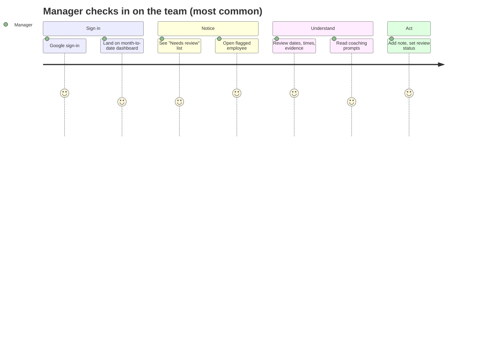

# Product Requirements Document

| | |
|---|---|
| **Version** | 1.2.0 |
| **Last updated** | 2026-08-04 |
| **Status** | Approved (Phase 1) |
| **Related** | [Master Spec](10_MASTER_SPECIFICATION.md) · [Data Spec](02_DATA_SPECIFICATION.md) · [Attendance Rules](03_ATTENDANCE_RULES.md) · [Permissions](04_PERMISSION_MATRIX.md) · [User Stories](05_USER_STORIES.md) · [Review Log Story](05a_USER_STORY_REVIEW_LOG.md) |

> **Purpose.** Define what the Edvoy Workforce Attendance Intelligence Platform must do, for whom, and why — in plain business language for HR, management and engineering. Attendance data describes punches and calendars, not people.

---

## Table of Contents

1. [Executive Summary](#1-executive-summary)
2. [Business Problem](#2-business-problem)
3. [Vision](#3-vision)
4. [Product Goals](#4-product-goals)
5. [Non-Goals](#5-non-goals)
6. [Stakeholders](#6-stakeholders)
7. [User Personas](#7-user-personas)
8. [User Journeys](#8-user-journeys)
9. [Functional Requirements](#9-functional-requirements)
10. [Non-Functional Requirements](#10-non-functional-requirements)
11. [User Stories](#11-user-stories)
12. [Acceptance Criteria](#12-acceptance-criteria)
13. [Success Metrics](#13-success-metrics)
14. [MVP Scope](#14-mvp-scope)
15. [Phase 2 Scope](#15-phase-2-scope-deferred-features)
16. [Out of Scope](#16-out-of-scope)
17. [Risks](#17-risks)
18. [Assumptions](#18-assumptions)
19. [Open Questions](#19-open-questions)

---

## 1. Executive Summary

Edvoy already captures attendance in Keka but has no management view over it. This platform consumes Keka's daily attendance export, the employee payroll master, the leave report and the holiday list, then turns them into policy-aware, explainable insights for reporting managers and administrators. It respects each employee's actual shift, distinguishes the real reason behind every non-working day, never infers absence from a missing row, and keeps a complete audit trail. It is explicitly not surveillance, not a productivity score, and not a disciplinary engine.

## 2. Business Problem

Managers who want to understand their team's attendance today must read a raw spreadsheet export and hold the shift rules in their head. Because teams run different shifts (fixed and flexible), the same clock-in can be on-time for one person and late for another. Approved WFH is indistinguishable from absence; a genuine short day from a missing clock-out. As a result: real patterns go unnoticed until serious; managers cannot separate a support need from a data-quality problem; absence is guessed at; and no shared history or record of follow-up exists.

The problem is **not** "collect attendance" — Keka does that. It is to give managers and administrators a trustworthy, policy-aware lens over data Edvoy already has.

## 3. Vision

A calm, trustworthy management lens that helps reporting managers support their teams and plan capacity — where every number is explainable, every employee's shift is respected, and privacy is the default.

## 4. Product Goals

| # | Goal |
|---|---|
| G1 | Make attendance legible to non-technical managers |
| G2 | Show patterns and trends, not isolated incidents |
| G3 | Respect the shift each employee actually works |
| G4 | Distinguish the reason behind a missing day (never infer absence from silence) |
| G5 | Keep every number explainable and drill-through |
| G6 | Support constructive manager action with notes and follow-up |
| G7 | Provide a reliable, auditable import backbone |
| G8 | Protect employee privacy by default |

## 5. Non-Goals

| # | Non-goal |
|---|---|
| N1 | Not a surveillance tool (no live location, screen, or keystroke tracking) |
| N2 | Not a productivity or performance score |
| N3 | Not a disciplinary system |
| N4 | Not a payroll or leave-approval engine (reads Keka's leave decisions) |
| N5 | Not a replacement for Keka clock-in |
| N6 | Not an employee-facing app in the first release |

## 6. Stakeholders

| Stakeholder | Interest |
|---|---|
| Reporting managers | Understand and support their teams |
| People / HR team | Import data, configure policy, organisation view |
| Senior management | Organisation-wide read-only insight |
| Super administrator (`syed@edvoy.com`) | Ownership, admin management, configuration |
| Employees | Fair, private, accurate treatment of their data |
| Engineering | Buildable, maintainable, secure system |

## 7. User Personas

| Persona | Role | Needs |
|---|---|---|
| **Reporting Manager** | Manages ≥1 active report | Team summary, employee detail, patterns, review workflow — scoped to their hierarchy |
| **Administrator** | People Ops / IT | Org-wide access, imports, policy, user & admin management, audit |
| **HR Data Operator** | HR executive / importer | Upload & validate files, import history, error downloads — no analytics unless granted |
| **Management Viewer** | HR / senior leadership | Read-only org-wide dashboards & reports |

Full permissions: [`04_PERMISSION_MATRIX.md`](04_PERMISSION_MATRIX.md).

## 8. User Journeys

Other journeys (detailed in [`05_USER_STORIES.md`](05_USER_STORIES.md)): HR Data Operator runs the daily import; Administrator sets a policy; a person outside the hierarchy requests access.

## 9. Functional Requirements

| ID | Area | Requirement |
|---|---|---|
| FR1 | Auth | Google Workspace sign-in restricted to approved domains (initially edvoy.com) |
| FR2 | Auth | Validate email against active employee before access; secure server-side sessions; store last login; log success/failure |
| FR3 | Auth | Server-side permission on every endpoint; row-level access by hierarchy; access-denied screen with request route ; access requests carry no applicant-chosen role — an administrator assigns the role on approval, default Read-Only (see Permissions §3a) |
| FR4 | Import | Guided Import Centre for employee master, attendance, holiday, leave |
| FR5 | Import | Accept .xlsx and .csv (.xls where safe); header detection + alias matching + saved mapping templates |
| FR6 | Import | Validate before commit; import valid / reject invalid / cancel; download rejected rows with reasons |
| FR7 | Import | Idempotent: file fingerprint + logical key prevent duplicates; updates preserve history |
| FR8 | Import | Full import history: uploader, timestamp, filename, type, status, counts, date range, hash, mapping version |
| FR9 | Employee | Master with identity, status, joining/exit, dept, location, shift, required hours, working days, manager |
| FR10 | Employee | Effective-dated assignments (manager, dept, shift, location) |
| FR11 | Hierarchy | Resolve direct & indirect reports; tolerate managers outside the imported set |
| FR12 | Metrics | Derive one attendance-day status per employee per date |
| FR13 | Metrics | Lateness, short hours, absence, remote %, data quality — against assigned policy |
| FR14 | Metrics | Eligible days as denominator; suppress when denominator too small; every metric drill-through |
| FR15 | Dashboard | Default current month-to-date; scoped filters; summary cards; four insight lists |
| FR16 | Review | Review status + private/HR notes, kept separate from raw data; a status or note creates or updates a review record that appears in the review log (FR20) |
| FR17 | Dashboard | Data-coverage warnings for missing/stale data |
| FR18 | Audit | Audit sign-in, access/admin change, import, rollback, policy change, correction, export, note, review change |
| FR19 | Reporting | Controlled exports recording who/when/filters/count; row-level access applied |
| FR20 | Review | Review log: a filterable, exportable record of reviews with status, action taken, follow-up date and a per-review audit trail; private manager notes are excluded from all listings and exports |

## 10. Non-Functional Requirements

| ID | Category | Requirement |
|---|---|---|
| NFR1 | Security | Encryption in transit & at rest; least privilege; secrets in a managed store |
| NFR2 | Security | CSRF, input & file validation, rate limiting, SQLi/XSS protection, spreadsheet-formula-injection neutralisation, secure cookies |
| NFR3 | Privacy | Row-level access by hierarchy; no cross-source personal compilation; sensitive masking where practical |
| NFR4 | Performance | See targets in [`08_TECHNICAL_CONSTRAINTS.md`](08_TECHNICAL_CONSTRAINTS.md) — 5,000+ employees, years of daily data |
| NFR5 | Accessibility | WCAG-friendly components; never rely on colour alone (e.g. heatmap) |
| NFR6 | Reliability | Idempotent imports; background jobs; backup & restore |
| NFR7 | Observability | App/import logs, error & performance monitoring, health checks, failed-import alerting |
| NFR8 | Auditability | Complete, tamper-evident audit trail; never log file contents or tokens |

## 11. User Stories

Summarised here; full detail in [`05_USER_STORIES.md`](05_USER_STORIES.md).

| Epic | Example story |
|---|---|
| Authentication & Access | As a manager, I sign in with Google and see only my hierarchy |
| Import Centre | As an HR operator, I upload the daily Keka file and a duplicate upload does not double-count |
| Metrics & Insights | As a manager, I see who is frequently late by their own shift, with evidence |
| Review Workflow | As a manager, I record a note and review status against an insight |
| Review Log | As a manager, I see a log of every review and the action taken, with follow-ups that are due (US-R1) |
| Administration | As an admin, I configure the late threshold and required hours without code |

## 12. Acceptance Criteria

The MVP is accepted when all 25 criteria hold (mirrored in [`05_USER_STORIES.md`](05_USER_STORIES.md#acceptance-criteria-master-list)):

1. A permitted user can sign in with Google authentication.
2. A manager sees only employees in their authorised hierarchy.
3. An administrator can see the full organisation.
4. An administrator can add/remove other administrators safely and cannot remove their own final super-admin access.
5. An authorised importer can upload an employee master.
6. An authorised importer can upload a Keka attendance export.
7. Files are validated before import.
8. Duplicate uploads do not create duplicate records.
9. Import history shows uploader, timestamp, filename, status and counts.
10. Invalid rows can be downloaded with error explanations.
11. Current-month analytics load by default.
12. Filters work for department, sub-department, location, manager and date.
13. Frequent lateness is calculated using the employee's assigned shift policy.
14. Short working hours use configurable required hours.
15. Absence is not falsely calculated from missing attendance alone.
16. Remote clock-in percentage is calculated correctly.
17. Every dashboard metric can be drilled into.
18. Every employee-level insight shows its calculation evidence.
19. Managers can record review status and notes.
20. Admin and user actions are auditable.
21. Deployed to a secure staging environment.
22. Automated tests pass.
23. Seed data included for demonstration.
24. Documentation sufficient for another engineer to operate the platform.
25. Reviews are recorded in a filterable, exportable log with follow-up tracking and a per-review audit trail; private notes are never exposed.

## 13. Success Metrics

| Metric | Intent |
|---|---|
| Manager weekly active use | The lens is genuinely useful |
| Insights reviewed vs raised | Insights lead to action, not noise |
| Import success rate | Reliable daily operations |
| Time-to-understand a team | Legibility goal (G1) |
| Unmapped-employee count trending to zero | Data completeness |
| Zero false-absence complaints | Correctness of absence handling (G4) |
| Review follow-up completion rate | Reviews are followed through, not dropped |
| Overdue reviews trending down | Follow-up discipline is improving |

## 14. MVP Scope

- Google sign-in (edvoy.com) with role + hierarchy access and access-request path.
- Employee-master and daily-attendance import via the guided Import Centre (alias matching, validation, idempotent commits, error downloads, history).
- Holiday-calendar and leave-report import so absence is trustworthy from day one.
- Attendance-day classification and core metrics: lateness (fixed shifts), short hours, absence (confirmed vs potential), remote share, missing-punch data quality.
- Manager dashboard (current month default, standard filters, summary cards, four insight lists) — all drill-through.
- Employee detail page with daily table, calendar and evidence.
- Manager review workflow: status and notes, plus a review log with follow-up tracking and outcome reporting.
- Admin settings for policies, shifts, holidays, premise mappings; user & admin management with super-admin safeguard.
- Audit logging of sensitive actions; controlled exports of core reports.
- Seed data and secure staging deployment.

## 15. Phase 2 Scope (Deferred Features)

- Employee self-service view of own attendance.
- Configurable in-app/email alert digests with snooze & acknowledgement.
- Manual HR exception entry (flexible timing, temporary shift change, field work, travel, correction) with supporting files.
- Advanced analytics: cohort/trend analysis, period comparison vs quarter & org averages, team-capacity/wellbeing signals, "what changed" summary.
- Monthly status-report import as a cross-check and reconciliation.
- Early-departure and overnight-shift handling as first-class metrics.
- PDF export styling, scheduled reports, subject-access / data-deletion workflows.
- Automated in-app / email reminders for overdue review follow-ups (the MVP surfaces overdue reviews in-app only).
- UI roll-back of a committed import.

## 16. Out of Scope

Surveillance features, productivity scoring, disciplinary automation, payroll/salary, leave approval, and direct attendance capture are permanently out of scope. See [Non-Goals](#5-non-goals).

## 17. Risks

See the consolidated risk register in [`10_MASTER_SPECIFICATION.md`](10_MASTER_SPECIFICATION.md#9-known-risks) (R1–R6). Product-level emphasis: mis-inferring absence (R2) is the highest-consequence failure and is designed against explicitly.

## 18. Assumptions

| # | Assumption |
|---|---|
| A1 | "8.30 hours" required daily hours = 8h30m (510 min) — **confirmed as org-wide default** |
| A2 | "5.5 days" = alternating/half working Saturdays; exact pattern in the working calendar (see PD2) |
| A3 | Keka "Effective Hours" is the authoritative measure of hours worked; used for short-hours by default |
| A4 | "Edvoy Office" and named locations = office; "Remote Clock In" and "WFH" = remote; new premise text defaults to unclassified |
| A5 | Blank out-time with 00:00 effective = missing clock-out, not a zero-hour/absent day |
| A6 | Leave report "Approved" status is the source of truth; pending/rejected does not excuse absence |
| A7 | Holidays apply by the employee's location |
| A8 | Policy defaults (30-min late, 20% frequency, 510-min required, >3 absence days, 75% remote) are tunable starting points |
| A9 | Google accounts on edvoy.com map 1:1 to master Work Email (the identity join key) |
| A10 | Flexible-shift employees are exempt from lateness until a core start time is configured |
| A11 | Keka combined day-codes (WO:P, P(MS), CL:P, …) decomposed per the parsing table in [`02_DATA_SPECIFICATION.md`](02_DATA_SPECIFICATION.md#header-aliases--day-code-parsing) |
| A12 | One attendance row per employee per day; more than one is a duplicate to review, not two shifts (unless overnight) |

## 19. Open Questions

The authoritative list of unresolved decisions lives in [`10_MASTER_SPECIFICATION.md`](10_MASTER_SPECIFICATION.md#10-pending-decisions) as **PD1–PD10**. They must not be assumed. Summary: external-manager identity (PD1), Saturday pattern (PD2), breaks & effective-vs-total (PD3), flexible-shift lateness (PD4), indirect-report default (PD5), leave completeness (PD6), approved remote locations (PD7), daily-vs-monthly authority (PD8), retention periods (PD9), domain/admin list (PD10).
