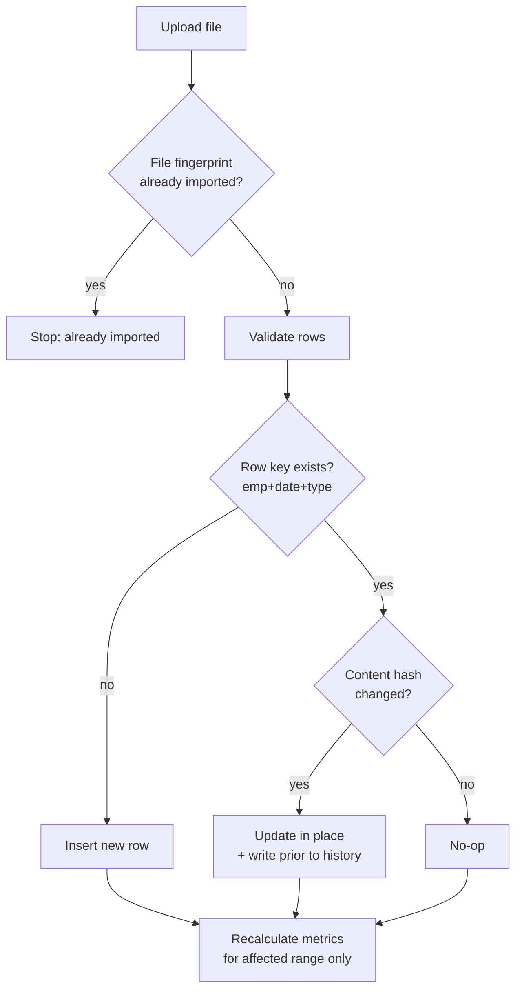
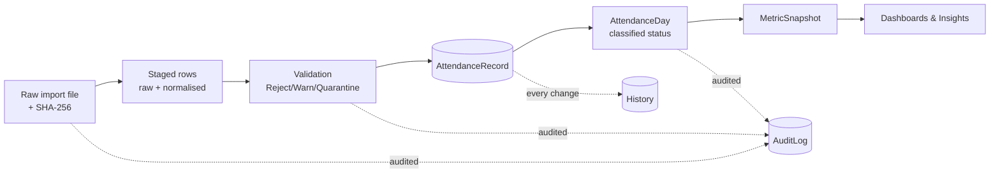

# Data Specification

| | |
|---|---|
| **Version** | 1.0.0 |
| **Last updated** | 2026-08-02 |
| **Status** | Approved (Phase 2) |
| **Related** | [Master Spec](10_MASTER_SPECIFICATION.md) · [PRD](01_PRODUCT_REQUIREMENTS.md) · [Attendance Rules](03_ATTENDANCE_RULES.md) |

> **Purpose.** The authoritative reference for every source file, its columns, quality issues, mappings, and the rules for importing, re-importing and correcting data. All figures are from the July 2026 sample exports.

---

## Table of Contents

1. [Source Systems](#1-source-systems)
2. [Employee Master Structure](#2-employee-master-structure)
3. [Attendance File Structure](#3-attendance-file-structure)
4. [Holiday File Structure](#4-holiday-file-structure)
5. [Leave File Structure](#5-leave-file-structure)
6. [Data Dictionary](#6-data-dictionary)
7. [Primary & Foreign Keys](#7-primary--foreign-keys)
8. [Column Mapping](#8-column-mapping-source-to-database)
9. [Header Aliases & Day-Code Parsing](#9-header-aliases--day-code-parsing)
10. [Data Validation Rules](#10-data-validation-rules)
11. [Data Quality Issues](#11-data-quality-issues)
12. [Duplicate Handling](#12-duplicate-handling)
13. [Incremental & Reimport Rules](#13-incremental--reimport-rules)
14. [Correction Rules](#14-correction-rules)
15. [Data Lineage](#15-data-lineage)

---

## 1. Source Systems

| File | Rows | Cols | Grain | Role |
|---|---|---|---|---|
| Daily attendance export | 1,580 | 15 | one employee, one day | Primary source of punches & hours |
| Monthly status report | 196 | 61 | one employee, one month | Cross-check / day-code source |
| Employee payroll master | 161 | 15 | one employee | Identity, shift, hierarchy, required hours |
| Leave report | 249 | 24 | one leave request | Excuses absence; classifies leave days |
| Holiday list | 13 × 6 sheets | 4 | one holiday, per location | Non-working days by location |

**Three foundational facts:**

1. **Coverage is partial.** 80 employees in daily attendance vs 161 in master → 82 master employees have no attendance; 1 attended employee (ED577) is missing from master. "No row" = "no data", never "absent".
2. **The daily file has no shift/email/required-hours columns** and stores the manager as a **name**, while master stores it as an **ID**. All calculations depend on joining to master by Employee Number.
3. **Effective Hours already resolves overnight shifts** — where out < in (6 rows), `(out + 24h − in)` matches Effective Hours to the minute.

## 2. Employee Master Structure

`Employee_Payroll_Master_Sheet.xlsx` — 161 rows, 15 columns.

| Column | Type | Req | Sample | Note |
|---|---|---|---|---|
| Employee Number | text | ✅ | `ED002`, `CON80`, `BD005` | 3 ID prefixes (ED/CON/BD) |
| Full Name | text | ✅ | Syed Shabir Zakiullah | |
| Work Email | email | ✅ | `syed@edvoy.com` | All @edvoy.com; Google join key |
| Employment Status | enum | ✅ | Working | Only value present in sample |
| Date Joined | date | ✅ | `2018-10-15` | Excel date |
| Exit Date | date | ⬜ | (blank) | 3 of 161 set |
| Department | text | ✅ | Engineering (Development) | |
| Sub Department | text | ⬜ | Central Team | |
| Location | text | ✅ | Zudo Chennai | |
| Reporting Manager Employee Number | text | ✅ | `ED036`, `193`, `2070` | 7 external IDs (see [DQ](#11-data-quality-issues)) |
| Reporting To | text | ⬜ | Syed Shabir Zakiullah | Manager name (display) |
| Shift Type | enum | ✅ | Flexible Shift / `9.30 AM - 6.30 PM` | See note |
| Shift Start Time | text | ✅ | Flexible Shift / `9.30 AM - 6.30 PM` | **Duplicate of Shift Type** |
| Required Daily Hours | text | ✅ | `8.30 hours` | Parse to 510 min |
| Working Days | text | ✅ | `5 days` / `5.5 days` | Two patterns |

> **Shift Type and Shift Start Time are identical columns.** Neither contains a real start time. The platform must parse the start out of the window string. Seven shift values: Flexible Shift + fixed windows 9.30–6.30, 10.00–7.00, 10.30–7.30, 11.00–8.00, 11.30–8.30, 1.00–10.00 PM.

## 3. Attendance File Structure

`Attendance_Report_1.xlsx` — 1,580 rows, 15 columns. Every cell imports as **text** (times are strings like `"10:05"`, not Excel time values).

| Column | Type | Req | Sample | Nulls |
|---|---|---|---|---|
| Date | date-text | ✅ | `01 Jul 2026` | 0 |
| Employee Number | text | ✅ | `ED518` | 0 |
| Employee Name | text | ⬜ | A A Aashiq Aftaab | 0 |
| Job Title | text | ⬜ | Senior Counsellor | 0 |
| Department | text | ⬜ | Sales | 0 |
| Sub Department | text | ⬜ | India B2B | 0 |
| Location | text | ⬜ | IEC Chennai | 0 |
| Cost Center | text | ⬜ | B2B | 18 (all Sales) |
| Reporting Manager | text (name) | ⬜ | Baskar Srinivasan | 0 |
| In Time | time-text | ✅ | `10:05` | 11 |
| Premise Name (IN) | text | ⬜ | Remote Clock In | 11 |
| Out Time | time-text | ⬜ | `19:46` (blank = no punch) | 195 |
| Premise Name (OUT) | text | ⬜ | Edvoy Office | 195 |
| Effective Hours | duration-text | ✅ | `09:45`, `00:00` | 0 |
| Total Hours | duration-text | ⬜ | `09:45` | 0 |

**A row is usable** with Date, Employee Number, and either In Time or Effective Hours.

**Premise vocabulary** (drives remote/office classification):

| Premise | Classify as | Note |
|---|---|---|
| Edvoy Office | Office | Standard office punch |
| Remote Clock In | Remote | Most common remote value |
| WFH | Remote | Alternate label |
| Vijayawada | Office (location leak) | Location name in premise column — flag |
| Attendance Adjustment | Manual / unknown | Admin-adjusted; data-quality flag |

## 4. Holiday File Structure

`Holiday_List.xlsx` — 6 sheets (Chennai, Hyderabad, Vijayawada, Bengaluru, Kerala, Delhi), 13 rows each, columns: `S.No`, `Public Holiday`, `Date`, `Day`. **The sheet name is the location.**

> ⚠️ **Highest import tolerance required.** Each sheet uses a different date convention: Chennai `01.01.2026` (DD.MM.YYYY), Hyderabad `January 1, 2026`, Bengaluru/Kerala only a month (`Jan`), Delhi mixes ISO dates with wrong years (2003, 2004). A tolerant per-sheet parser must resolve to a real 2026 date or **quarantine** the row — never guess.

## 5. Leave File Structure

`Leave_Report.xlsx` — 249 rows, 24 columns.

| Column | Type | Req | Note |
|---|---|---|---|
| Employee Number | text | ✅ | Join key |
| Leave Types | enum | ✅ | Sick (122), Casual (95), Privilege (27), Maternity (2), Comp Offs (1) |
| From Date / To Date | date | ✅ | Excel date |
| From Session / To Session | enum | ✅ | FirstHalf / SecondHalf (half-day support) |
| Total Duration | number | ✅ | 0.5 or 1.0 (24 half-days, 201 full) |
| Unit | text | ⬜ | Days |
| Status | enum | ✅ | Approved (242), Rejected (2), Cancelled (2), Pending (1) |
| Requested On / By, Last Action by / on, Next Approver, Note, Reason | mixed | ⬜ | Audit/context |

> Only **Approved** leave excuses absence. A trailing footer row (`Generated on 31 Jul 2026`) must be stripped on import.

## 6. Data Dictionary

The dictionary is the union of sections 2–5. Types resolve to: `text`, `email`, `enum`, `date` (ISO), `time` (HH:MM 24h), `duration` (minutes), `number`. **Required fields** are marked ✅; all others are optional and stored for audit/denormalised display. Sample values appear inline above.

## 7. Primary & Foreign Keys

| Entity | Primary key (business) | DB primary key | Foreign keys |
|---|---|---|---|
| Employee | Employee Number | UUID | manager → Employee (self); via ReportingHierarchy |
| AttendanceRecord | employee_number + attendance_date + record_type | UUID | employee_id → Employee |
| LeaveRecord | emp + type + from_date + to_date | UUID | employee_id → Employee |
| Holiday | location + holiday_date | UUID | location → Premise/Location |

> Business identifier = Employee Number; database primary keys are internal UUIDs. Both original imported values and normalised values are stored.

## 8. Column Mapping (Source → Database)

**Daily attendance → `AttendanceRecord`**

| Source column | Target field | Transform |
|---|---|---|
| Date | attendance_date | parse `DD Mon YYYY` |
| Employee Number | employee_id | resolve to Employee UUID via master |
| In Time | clock_in | parse HH:MM |
| Out Time | clock_out | parse HH:MM, +24h if `< clock_in` |
| Premise Name (IN/OUT) | premise_in_id / premise_out_id | map via PremiseMapping |
| Effective Hours | effective_minutes | HH:MM → minutes |
| Total Hours | total_minutes | HH:MM → minutes |
| Employee Name … Reporting Manager | raw_snapshot (JSON) | stored verbatim for audit |

**Employee master → `Employee` + `EmployeeAssignmentHistory`**

| Source column | Target field | Transform |
|---|---|---|
| Employee Number | employee_number | business key; UUID assigned |
| Full Name | full_name | trim |
| Work Email | work_email | lower-case; Google identity key |
| Employment Status | employment_status | enum |
| Date Joined / Exit Date | joined_on / exited_on | Excel date → date |
| Department / Sub Dept / Location | assignment history | effective-dated |
| Reporting Manager Emp No | ReportingHierarchy.manager_id | resolve; stub if external |
| Shift Type / Start Time | Shift + PolicyAssignment | split regime; parse start/end |
| Required Daily Hours | AttendancePolicy.required_minutes | `8.30 hours` → 510 |
| Working Days | WorkingCalendar.days_per_week | `5.5 days` → 5.5 |

**Leave → `LeaveRecord` · Holiday → `Holiday` · Status report → cross-check only (MVP)**

| Source | Target | Transform |
|---|---|---|
| Leave: Emp No, Leave Types | employee_id, leave_type | resolve; enum |
| Leave: From/To Date + Session | start/end + half-day | pair date with FirstHalf/SecondHalf |
| Leave: Status | status | only Approved excuses absence |
| Holiday: Public Holiday, Date | name, holiday_date | per-sheet parser; sheet = location |
| Status report: day codes | validation only | decode via table below; reconcile with daily |

## 9. Header Aliases & Day-Code Parsing

**Header aliases** (case- and space-insensitive):

| Canonical | Accepted aliases |
|---|---|
| employee_number | Employee Number, Employee ID, Emp ID, EmpNo |
| employee_name | Employee Name, Name, Full Name |
| attendance_date | Date, Attendance Date, Day |
| clock_in | In Time, Clock In, First In, In |
| clock_out | Out Time, Clock Out, Last Out, Out |
| premise_in | Premise Name (IN), Clock-in Location, In Premise |
| premise_out | Premise Name (OUT), Clock-out Location, Out Premise |
| effective_minutes | Effective Hours, Worked Hours, Net Hours |
| total_minutes | Total Hours, Gross Hours, Elapsed Hours |
| sub_department | Sub Department, Sub-Department, Team |
| reporting_manager_name | Reporting Manager, Line Manager, Manager |
| cost_center | Cost Center, Cost Centre, CC |
| job_title | Job Title, Designation, Role |

**Status-report day-code parsing** (22 codes seen; combined codes use `base:overlay`):

| Code | Meaning | Attendance-day status |
|---|---|---|
| P | Present | Present |
| A | Absent | Absent (confirmed if unexcused) |
| WO | Weekly off | Weekly off |
| WOW | Weekly off (variant) | Weekly off |
| WO:P | Worked on a weekly off | Weekly off — worked |
| WO:A / WO:SL / WO:CL / WO:ML / WO:WFH | Weekly off + overlay | Weekly off (overlay noted) |
| P(MS) | Present, missing swipe | Present + data-quality flag |
| WO:P(MS) | Worked weekly off, missing swipe | Weekly off — worked + flag |
| SL / CL / PL / ML | Sick / Casual / Privilege / Maternity | Approved leave |
| CO | Comp off | Approved leave (comp off) |
| WFH | Work from home | Present remotely |
| P:CL / P:SL | Present half + leave half | Present (half-day leave) |
| CL:P / CL:A / CL:P(MS) | Leave half + present/absent half | Half-day leave (overlay) |

## 10. Data Validation Rules

**Actions:** Reject (not imported) · Warn (imported + flag) · Quarantine (held for admin).

**Employee master**

| Rule | Action |
|---|---|
| Employee Number missing/blank | Reject |
| Duplicate active Employee Number | Reject |
| Work Email missing / not approved-domain | Reject |
| Date Joined missing/unparseable | Reject |
| Exit Date before Date Joined | Reject |
| Manager ID not found in master | Quarantine (external stub) |
| Self-reference not the known root | Warn |
| Circular reporting chain | Quarantine |
| Required Daily Hours unparseable | Warn (fall back to 510) |
| Unknown department/location | Warn |

**Daily attendance**

| Rule | Action |
|---|---|
| Date or Employee Number missing | Reject |
| Employee Number not in master | Quarantine (unmapped, e.g. ED577) |
| Date unparseable | Reject |
| In & Out & Effective all blank | Reject (empty row) |
| In present, Out blank | Warn — Missing clock-out |
| Out present, In blank | Warn — Missing clock-in |
| Out < In | Warn — treat as overnight, verify vs Effective |
| Effective > (Out+24h − In) by > 2 min | Warn — duration mismatch/glitch |
| Effective ≥ 18h | Warn — implausible duration |
| Date before Date Joined / after Exit Date | Warn — outside employment |
| Date in the future | Reject |
| Premise not in map | Warn — unclassified |
| > 1 row per employee + date | Quarantine — review, don't sum |

## 11. Data Quality Issues

Observed in the July sample (Sev: High blocks a correct calc, Med distorts a metric, Low cosmetic):

| # | Finding | Where | Count | Sev | Handling |
|---|---|---|---|---|---|
| D1 | Missing clock-out (In present, Out/Eff blank/00:00) | Daily | 204 | High | Missing clock-out; exclude from short-hours; flag |
| D2 | Missing clock-in | Daily | 11 | High | Missing clock-in; not absent |
| D3 | Overnight span (Out < In) | Daily | 6 | High | +24h to Out; verify vs Effective |
| D4 | Implausible duration (Eff ≥ 18h) | Daily | ~5 | High | Flag; e.g. ED567 `04:00→03:59`=23:58; ED639 `05:14→23:28`=18:13 |
| D5 | Location in premise column (Vijayawada) | Daily | several | Med | Map to Office; flag mapping gap |
| D6 | "Attendance Adjustment" premise | Daily | several | Med | Mark adjusted; not office/remote |
| D7 | Cost Center blank for all Sales | Daily | 18 | Low | Backfill from master |
| D8 | Manager name (daily) vs ID (master) | Both | all | High | Resolve hierarchy from master IDs only |
| D9 | Attended employee absent from master (ED577) | Cross | 1 | High | Quarantine as unmapped |
| D10 | Master employees with no attendance | Cross | 82 | Med | Show "no data", never absent |
| D11 | Shift Type = Shift Start Time | Master | all | High | Parse start from window string |
| D12 | Required Daily Hours as text "8.30 hours" | Master | all | Med | Parse → 510 min |
| D13 | "5.5 days" working week | Master | 116 | Med | Encode Saturday pattern |
| D14 | External manager IDs not in master | Master | 7 IDs | High | 1, 172, 177, 193, 200, 2070, BD005 → stubs |
| D15 | Self-referencing manager (ED002→ED002) | Master | 1 | Low | Recognise as root; stop recursion |
| D16 | Holiday dates in many formats / per-location sheets | Holiday | 6 sheets | High | Per-format parser; quarantine unresolved |
| D17 | Footer row "Generated on 31 Jul 2026" | Leave | 1 | Med | Strip trailing non-data rows |
| D18 | Pending/Rejected/Cancelled leave present | Leave | 5 | High | Only Approved excuses absence |

## 12. Duplicate Handling

| Risk | How it arises | Detection key | Action |
|---|---|---|---|
| Same file re-uploaded | Operator uploads twice | File fingerprint (SHA-256) | Skip — already imported |
| Overlapping date ranges | Two exports share a date | employee_number + date + record_type | Update in place; keep prior in history |
| Two rows, same emp+day | Two shifts / correction re-punch | employee_number + date | Flag for review; never silently sum |
| Duplicate leave request | Re-submitted leave | emp + type + from + to | De-duplicate on logical key |
| Employee in two master rows | Re-hire / import error | employee_number (active) | Reject duplicate active record |

## 13. Incremental & Reimport Rules

- **File-level fingerprint** — SHA-256 of contents; exact match ⇒ "already imported", no rows touched.
- **Row-level logical key** — `employee_number + attendance_date + record_type`; shared dates update in place, never duplicate.
- **Change detection** — per-row content hash decides insert / update / no-op.
- **Preserve history** — updates write prior values to attendance history with the import ID.
- **Scope by date range** — reprocessing only touches dates present in the file; an old re-upload can never blank newer days.
- **Leave & master** follow the same pattern on their own logical keys.

## 14. Correction Rules

- Corrections are **versioned, never overwritten silently** — prior value, new value, who, when, source (re-import vs manual) all recorded.
- A newer import supersedes an older one for the same key, only within the file's date range, only if content differs.
- **Manual corrections are first-class and attributed** — fixing a missing clock-out creates a correction record; the original imported value is preserved.
- Derived metrics recalculate automatically for the affected employee and date range; the recalculation is logged.
- Adjustments are **typed** ("Attendance Adjustment" premises and manual fixes tagged so a manager sees a day was adjusted, not clocked).
- Corrections respect access — only administrators (later, authorised HR); every correction is audited.

## 15. Data Lineage

Every attendance figure is traceable back through MetricSnapshot → AttendanceDay → AttendanceRecord → the exact import file and row it came from. See [`03_ATTENDANCE_RULES.md`](03_ATTENDANCE_RULES.md) for how AttendanceDay is derived.
