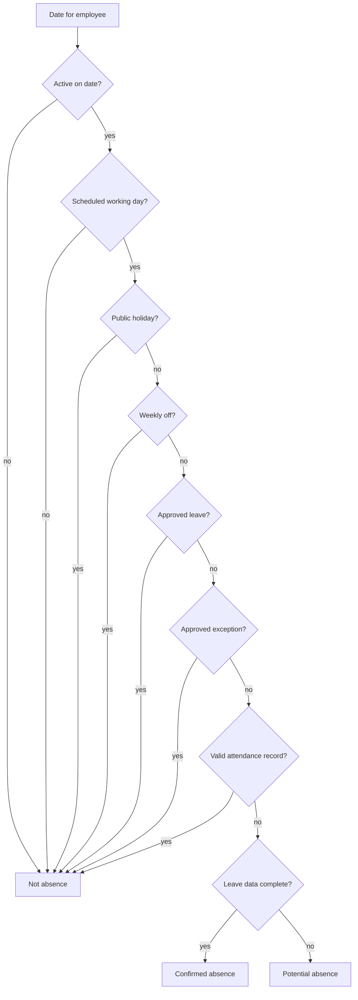

# Attendance Calculation Rules

| | |
|---|---|
| **Version** | 1.0.0 |
| **Last updated** | 2026-08-02 |
| **Status** | Approved (Phases 1–2) |
| **Related** | [Master Spec](10_MASTER_SPECIFICATION.md) · [PRD](01_PRODUCT_REQUIREMENTS.md) · [Data Spec](02_DATA_SPECIFICATION.md) |

> **Purpose.** Define exactly how raw punches become metrics. Every threshold is a **configurable default**, not a hard-coded constant. Values below are the agreed initial defaults.

---

## Table of Contents

1. [Shift Definitions](#1-shift-definitions)
2. [General (Fixed) Shift Rules](#2-general-fixed-shift-rules)
3. [Flexible Shift Rules](#3-flexible-shift-rules)
4. [Grace Period](#4-grace-period)
5. [Late Calculation](#5-late-calculation)
6. [Effective Hours Calculation](#6-effective-hours-calculation)
7. [Short Hours Rules](#7-short-hours-rules)
8. [Attendance Percentage Rules](#8-attendance-percentage-rules)
9. [Remote Attendance Rules](#9-remote-attendance-rules)
10. [Missing Punch Rules](#10-missing-punch-rules)
11. [Weekly Off Rules](#11-weekly-off-rules)
12. [Holiday Rules](#12-holiday-rules)
13. [Joining Date Rules](#13-joining-date-rules)
14. [Exit Date Rules](#14-exit-date-rules)
15. [Leave Rules](#15-leave-rules)
16. [Confirmed vs Potential Absence](#16-confirmed-vs-potential-absence)
17. [Attendance-Day Classification](#17-attendance-day-classification)
18. [Exception Handling](#18-exception-handling)
19. [Edge Cases](#19-edge-cases)
20. [Formula Definitions](#20-formula-definitions)
21. [Threshold Configuration](#21-threshold-configuration)
22. [Business Examples](#22-business-examples)

---

## 1. Shift Definitions

The payroll master runs two shift regimes, and this distinction drives almost every rule.

| Regime | Recorded as | Lateness measured? | Required hours |
|---|---|---|---|
| **Fixed-time** | Window string e.g. `9.30 AM - 6.30 PM` | ✅ Yes — against that employee's own start | Applies |
| **Flexible** | Literally `Flexible Shift` (no start time) | ❌ No — unless a core start is configured (PD4) | Applies |

Seven distinct shift values exist (see [Data Spec](02_DATA_SPECIFICATION.md#2-employee-master-structure)). Start times vary per employee, so lateness is always judged against the individual's start, never a company-wide time.

## 2. General (Fixed) Shift Rules

- A definite scheduled start exists → lateness can be measured.
- Late, short-hours, early-departure and remote metrics all apply.
- Scheduled start is **parsed from the window string**, not read from the (duplicate) Shift Start Time column.

## 3. Flexible Shift Rules

- **Not measured for lateness** unless the policy defines an expected start, a core-hours start, or a latest acceptable start (currently none — see [PD4](10_MASTER_SPECIFICATION.md#10-pending-decisions)).
- Required daily hours still apply → short-hours metric still applies.
- Remote and missing-punch metrics apply normally.

## 4. Grace Period

- Configurable per policy. Applied **before** the late threshold.
- A clock-in within `scheduled_start + grace` is on time.

## 5. Late Calculation

```
late_minutes = actual_in_time − scheduled_start_time − grace_period
```

An employee is **late for a day** when `late_minutes > late_threshold` (default **> 30 minutes** after scheduled start). Per employee & period the platform computes: late days, eligible scheduled days, late %, average & median late minutes, max late minutes, longest consecutive late run, and trend vs previous period.

**Frequent lateness** is flagged when late days reach the configured share of eligible days (default **≥ 20%**). The exact boundary (`≥ 20%` vs `> 20%`) is a policy setting shown in the tooltip.

## 6. Effective Hours Calculation

- **Keka's `Effective Hours` is authoritative** for worked time and is used by default.
- It already resolves overnight shifts: where `Out < In`, the out-punch belongs to the next day and `(Out + 24h − In)` matches Effective Hours to the minute (verified on all 6 overnight rows in the sample).
- Clock times are used only to reconstruct spans and detect missing punches; they are often incomplete.

## 7. Short Hours Rules

- Uses **effective hours** by default; an admin may switch a policy to total hours.
- For each attended day: compare actual effective hours vs required hours; record any deficit.
- Computes short-hour days, share of attended days below required, average & median daily hours, total deficit, and trend.
- **Frequent short hours** flagged above the configured share of attended eligible days (default **20%**).
- Approved half-days and policy exceptions are **never** counted as short hours.

> **Required daily hours is a configurable policy value**, exactly like the frequency threshold. Org-wide default = **8.30 hours (8h30m = 510 min)**, matching the master. **9 hours** is available as an admin override, not the default. It uses the same policy scoping (company, country, location, department, shift, employment type, individual exception, effective date) and is effective-dated. Remaining open part (PD3): breaks in/out, and effective-vs-total.

## 8. Attendance Percentage Rules

- All frequency metrics use **eligible days** as the denominator.
- Frequency is **suppressed** when the denominator is too small to be reliable (a coverage warning is shown instead).
- Eligible days must read **working days per employee** (5 vs 5.5) — never assume a five-day week.

## 9. Remote Attendance Rules

- Detected from premise text via configurable mappings: Office = Edvoy Office + named locations; Remote = Remote Clock In, WFH, Home, Remote.
- Computes remote days, office days, mixed-premise days, remote %, and trend.
- **Remote is not negative by default.** Flagged only when remote share exceeds policy (default **> 75%** of attended days) or differs from the employee's approved arrangement (arrangement source is [PD7](10_MASTER_SPECIFICATION.md#10-pending-decisions)).

## 10. Missing Punch Rules

- In present + Out/Effective blank/00:00 → **Missing clock-out** (204 rows in sample). Not a short day, not absent.
- Out present + In blank → **Missing clock-in** (11 rows).
- Missing punches feed the data-quality score; they never reduce the absence or short-hours numbers.

## 11. Weekly Off Rules

- Weekly offs come from the working calendar (Keka codes `WO`, `WOW`). A worked weekly off is `WO:P` (weekly off — worked).
- The 5.5-day pattern needs the exact Saturday definition ([PD2](10_MASTER_SPECIFICATION.md#10-pending-decisions)) to compute eligible days correctly.

## 12. Holiday Rules

- Holidays apply **by the employee's location** (sheet name = location in the holiday file).
- A holiday date is never counted as absence or short hours and is excluded from eligible days.

## 13. Joining Date Rules

- Dates before `Date Joined` → **Joined after this date**; excluded from all metrics.

## 14. Exit Date Rules

- Dates after `Exit Date` → **Exited before this date**; excluded from all metrics.
- Attendance rows before joining or after exit are **warned**, not silently accepted.

## 15. Leave Rules

- Only **Approved** leave (from the leave report) excuses a day; Pending/Rejected/Cancelled do not.
- Half-days are supported via `FirstHalf`/`SecondHalf` sessions and `Total Duration` (0.5 / 1.0).
- Approved leave is classified **Approved leave**, never absence.

## 16. Confirmed vs Potential Absence

> **Absence is never inferred from a missing row alone.**

A date is **Confirmed unexplained absence** only when **all** hold:



Confirmed and Potential absence are **always reported as separate numbers**. **Frequent absence** default = **more than 3 confirmed unexplained days** in the period.

## 17. Attendance-Day Classification

Exactly one status per employee per date (foundation of every metric):

| Status | Decided by |
|---|---|
| Present in office | Valid record, office premise |
| Present remotely | Valid record, remote premise |
| Hybrid / mixed premise | In and out premises differ in category |
| Approved leave | Matched approved leave row |
| Public holiday | Date in location's holiday calendar |
| Weekly off | Working-calendar weekly off (WO/WOW) |
| Joined after this date | Before joining date |
| Exited before this date | After exit date |
| Missing clock-in | Out present, In absent |
| Missing clock-out | In present, Out absent (00:00 effective) |
| Incomplete attendance | Both punches absent/invalid on a working day |
| Short hours | Attended but effective < required (per policy) |
| Late arrival | Fixed shift, in-time past start+grace+threshold |
| Early departure | Fixed shift, out before scheduled end (per policy) |
| Absent (confirmed) | All absence conditions met |
| Potential absence | Working day, no record, leave data incomplete |
| Data unavailable | Attendance not imported for the date |
| Excluded by policy | Policy excludes (e.g. field work, outage) |

> Combined Keka codes are decomposed: `WO:P` = weekly off worked; `P(MS)` = present with a data-quality flag, not a clean present. Full table in [Data Spec](02_DATA_SPECIFICATION.md#9-header-aliases--day-code-parsing).

## 18. Exception Handling

- Approved half-days and policy exceptions are excluded from short-hours and lateness.
- Manual HR exceptions (flexible timing, temporary shift change, field work, travel, correction, system outage) are a **Phase 2** feature; each will carry reason, effective dates, entered-by, timestamp, optional file, and audit trail.

## 19. Edge Cases

| Case | Rule |
|---|---|
| Out < In | Overnight — add 24h to Out; verify vs Effective Hours |
| Effective ≥ 18h (e.g. ED567 23:58, ED639 18:13) | Flag as implausible/glitch; do not trust |
| Effective > elapsed (In..Out) | Warn — duration mismatch |
| 00:00 effective with In present | Missing clock-out, not zero-work absence |
| Employee in attendance but not master (ED577) | Quarantine as unmapped; metrics attach to nobody until resolved |
| Master employee with no attendance | "No data", never absent |
| Self-referencing manager (ED002) | Hierarchy root; stop recursion |
| Premise = "Vijayawada" / "Attendance Adjustment" | Map to office / mark adjusted; flag |

## 20. Formula Definitions

| Metric | Formula |
|---|---|
| Late minutes | `actual_in − scheduled_start − grace` |
| Late day | `late_minutes > late_threshold` (default 30 min) |
| Late % | `late_days ÷ eligible_scheduled_days` |
| Overnight span | `(clock_out + 24h) − clock_in` |
| Short-hours day | `effective_minutes < required_minutes` |
| Short-hours % | `short_days ÷ attended_eligible_days` |
| Hours deficit | `Σ (required_minutes − effective_minutes)` over short days |
| Confirmed absence | all conditions in §16 satisfied |
| Remote % | `remote_days ÷ attended_days` |
| Data-quality score | composite of missing-punch, invalid-duration, duplicate flags |

## 21. Threshold Configuration

All configurable per policy (company, country, location, department, shift, employment type, individual exception, effective date):

| Setting | Default | Notes |
|---|---|---|
| Grace period | (policy) | Applied before late threshold |
| Late threshold | > 30 min after start | Fixed shifts only |
| Frequent-lateness threshold | ≥ 20% of eligible days | Boundary configurable (≥ vs >) |
| Required daily hours | **510 min (8h30m)** | 9h available as override; effective-dated |
| Short-hours measure | Effective hours | Admin may switch to total |
| Frequent short-hours threshold | > 20% of attended days | |
| Frequent absence threshold | > 3 confirmed unexplained days | |
| Frequent remote threshold | > 75% of attended days | Or ≠ approved arrangement |
| Min records for frequency | (policy) | Below this, suppress + coverage warning |

## 22. Business Examples

**Example A — Fixed-shift late (ED037, 11:30 start).** Clocks in 12:05, grace 10 min. `late = 12:05 − 11:30 − 10 = 25 min`. With a 30-min threshold, **not** a late day. At 12:15 (`late = 35`), it **is** a late day.

**Example B — Overnight (ED518, 01 Jul).** In `10:05`, Out `01:25`, Effective `15:19`. Out < In → overnight; `(01:25 + 24h) − 10:05 = 15h20m` ≈ Effective `15:19`. Trusted as a long overnight day.

**Example C — Missing clock-out (ED518, 22 Jul).** In `10:00`, Out blank, Effective `00:00`. Classified **Missing clock-out** — flagged for data quality, excluded from short-hours, **not** absent.

**Example D — No row ≠ absent.** A master employee with no attendance row on a working day with no leave and complete leave data → **Confirmed absence**. If leave data is incomplete → **Potential absence**. If it's a holiday for their location or a weekly off → neither.

**Example E — Flexible shift (ED002).** Clocks in 11:40. Flexible regime with no configured core start → **no late flag**. Required 8h30m still applies to short-hours.
