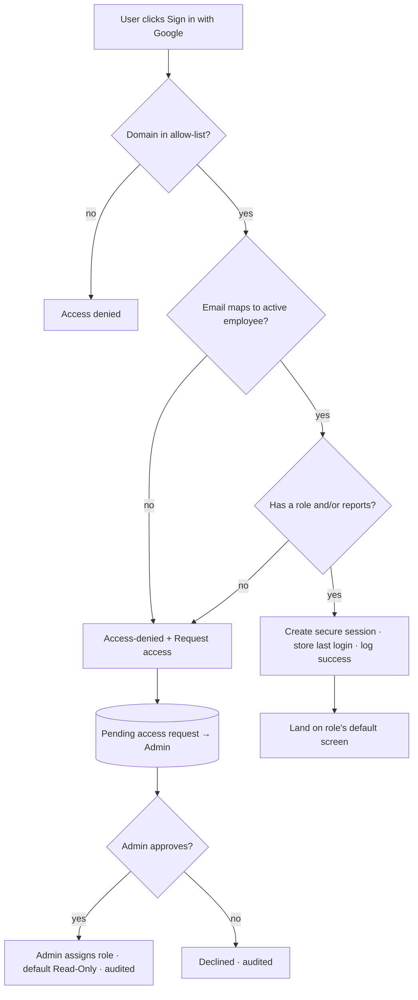

# Permission Matrix

| | |
|---|---|
| **Version** | 1.2.0 |
| **Last updated** | 2026-08-04 |
| **Status** | Approved (Phase 1) |
| **Related** | [Master Spec](10_MASTER_SPECIFICATION.md) · [PRD](01_PRODUCT_REQUIREMENTS.md) · [Dashboard Spec](06_DASHBOARD_SPECIFICATION.md) · [Review Log Story](05a_USER_STORY_REVIEW_LOG.md) |

> **Purpose.** Define authentication, roles, reporting-hierarchy rules, and every access matrix. **Access is always the intersection of role and hierarchy** — the smaller of what the role allows and what the person's reporting line permits. Front-end checks are never the only guard; every endpoint is enforced server-side.

---

## Table of Contents

1. [Authentication](#1-authentication)
2. [Google Login](#2-google-login)
3. [User Roles](#3-user-roles)
3a. [Access-Request & Role-Assignment Governance](#3a-access-request--role-assignment-governance)
4. [Reporting Hierarchy Rules](#4-reporting-hierarchy-rules)
5. [Data Visibility Matrix](#5-data-visibility-matrix)
6. [API Permission Matrix](#6-api-permission-matrix)
7. [Dashboard Visibility Matrix](#7-dashboard-visibility-matrix)
8. [Import Permissions](#8-import-permissions)
9. [Export Permissions](#9-export-permissions)
10. [Audit Permissions](#10-audit-permissions)

---

## 1. Authentication

| Requirement | Rule |
|---|---|
| Provider | Google Workspace / Google OAuth (Auth.js or equivalent) |
| Domain restriction | Approved company domains only, initially `edvoy.com` (domain list = [PD10](10_MASTER_SPECIFICATION.md#10-pending-decisions)) |
| Identity binding | Authenticated email validated against an **active employee** (join key = master Work Email) |
| Sessions | Secure server-side sessions; automatic expiry & logout; last-login stored |
| Logging | Successful **and** failed sign-ins logged |
| Authorisation | Role-based + row-level hierarchy on every endpoint |
| Access denied | Screen with a "request access" route. The applicant submits **identity and an optional justification only — never a role**; the request appears in the admin's pending queue, where an **administrator assigns the role on approval** (see §3a) |

## 2. Google Login

## 3. User Roles

| Role | Who | Scope |
|---|---|---|
| **Super Administrator** | `syed@edvoy.com` (initial) | Everything an Administrator has, plus is the protected final admin |
| **Administrator** | People Ops / IT | Organisation-wide, full configuration & management |
| **Reporting Manager** | Employee with ≥1 active direct report | Own hierarchy only |
| **HR Data Operator** | HR executive / importer | Imports & import history; **no** analytics unless separately granted |
| **Read-Only User (Management Viewer)** | HR / senior leadership | Org-wide dashboards & reports, view-only |

**Super-admin safeguard:** an administrator can add/remove other administrators, but the system **must prevent removal of the final super-admin access** (the last remaining super admin cannot be removed accidentally).

## 3a. Access-Request & Role-Assignment Governance

Access is granted by an administrator, never self-selected by the requester. This rule closes an ambiguity in earlier versions and is enforced server-side.

| Stage | Rule |
|---|---|
| **Request (applicant)** | An authenticated-but-unauthorised user may submit an access request carrying **only** their identity (name, work email from the verified session) and an **optional free-text justification**. The request form **must not** offer or capture a role. |
| **Queue (admin)** | The pending-requests queue shows each applicant's identity, timestamp and justification. It **must not** present an applicant-supplied "requested role" as if it were entitled or pre-approved. |
| **Approve (admin)** | Approval is a deliberate role-granting action: the administrator **must choose the role** to grant, defaulting to the **least-privilege Read-Only**. Approval creates the active user with exactly that role and clears the request. |
| **Decline (admin)** | Declining closes the request with no user created. |
| **Audit** | Both approve (with the granted role) and decline are written to the audit log with actor, subject, role granted (if any) and timestamp. |
| **Least privilege** | No path may grant a role higher than the administrator explicitly selects. A request never carries a role into the grant. |

> **Rationale.** A requester who could name their own role could anchor or pre-empt the approval decision. Separating *who requests* from *who grants the role* keeps access decisions with administrators and preserves least-privilege.

## 4. Reporting Hierarchy Rules

| Rule | Detail |
|---|---|
| Direct reports | A manager sees every active employee whose reporting manager is that manager |
| Indirect reports | Visible **only if an administrator enables it**; otherwise view stops at direct reports ([PD5](10_MASTER_SPECIFICATION.md#10-pending-decisions)) |
| Strict boundary | A manager can never see, filter to, or export anyone outside their own line |
| Admin & Viewer | See the whole organisation (edit vs read-only by role) |
| Effective-dated | Access follows the reporting relationship **as it stood during the viewed period** |
| External managers | Managers referenced only by external IDs (1, 172, 177, 193, 200, 2070, BD005) must still have reachable reports via an admin/designate ([PD1](10_MASTER_SPECIFICATION.md#10-pending-decisions)) |

## 5. Data Visibility Matrix

| Data | Super Admin | Administrator | Reporting Manager | HR Operator | Read-Only |
|---|---|---|---|---|---|
| Own hierarchy employees | ✅ (all) | ✅ (all) | ✅ (own line) | ⬜* | ✅ (all) |
| Employees outside line | ✅ | ✅ | ❌ | ⬜* | ✅ |
| Attendance records | ✅ | ✅ | ✅ (own line) | ⬜* | ✅ |
| Employee-level insights | ✅ | ✅ | ✅ (own line) | ⬜* | ✅ |
| Manager notes (private) | ✅ | ✅ | ✅ (own) | ❌ | ❌ |
| Manager notes (HR-visible) | ✅ | ✅ | ✅ (own line) | ⬜* | ✅ |
| Review records (status, action, follow-up) | ✅ | ✅ | ✅ (own line) | ⬜* (HR-visible fields) | ✅ (view) |
| Review audit trail | ✅ | ✅ | ✅ (own line) | ⬜* (HR-visible events) | ✅ (view) |
| Import files & errors | ✅ | ✅ | ❌ | ✅ | ❌ |
| Policy configuration | ✅ | ✅ | ❌ | ❌ | ❌ |
| Audit log | ✅ | ✅ | ❌ | ❌ | ❌ |

`✅` allowed · `❌` denied · `⬜*` only if separately authorised (HR Operator does not receive analytics by default).

## 6. API Permission Matrix

| Endpoint group | Super Admin | Administrator | Manager | HR Operator | Read-Only |
|---|---|---|---|---|---|
| `GET /me`, `POST /auth/*` | ✅ | ✅ | ✅ | ✅ | ✅ |
| `GET /employees` (scoped) | ✅ | ✅ | ✅ (own line) | ⬜* | ✅ |
| `GET /attendance`, `/metrics` (scoped) | ✅ | ✅ | ✅ (own line) | ⬜* | ✅ |
| `POST /imports/*` | ✅ | ✅ | ❌ | ✅ | ❌ |
| `GET /imports/history` | ✅ | ✅ | ❌ | ✅ | ❌ |
| `POST /reviews`, `/notes` | ✅ | ✅ | ✅ (own line) | ❌ | ❌ |
| `GET /reviews`, `/reviews/:id/events` (scoped) | ✅ | ✅ | ✅ (own line) | ⬜* (HR-visible) | ✅ (view) |
| `PUT /policies/*`, `/shifts/*`, `/holidays/*`, `/premises/*` | ✅ | ✅ | ❌ | ❌ | ❌ |
| `POST /users`, `/roles`, `/admins` | ✅ | ✅ (not final super-admin) | ❌ | ❌ | ❌ |
| `POST /corrections` | ✅ | ✅ | ❌ | ⬜* | ❌ |
| `POST /exports/*` (scoped) | ✅ | ✅ | ✅ (own line) | ⬜* | ✅ |
| `GET /audit` | ✅ | ✅ | ❌ | ❌ | ❌ |

Every scoped endpoint enforces row-level hierarchy server-side, independent of any front-end state.

## 7. Dashboard Visibility Matrix

| Screen | Super Admin | Administrator | Manager | HR Operator | Read-Only |
|---|---|---|---|---|---|
| Manager Dashboard | ✅ | ✅ | ✅ (own line) | ❌ | ✅ (all) |
| Organisation Dashboard | ✅ | ✅ | ❌ | ❌ | ✅ |
| Employee Detail | ✅ | ✅ | ✅ (own line) | ⬜* | ✅ |
| Attendance Heatmap | ✅ | ✅ | ✅ (own line) | ⬜* | ✅ |
| Insight Lists / Review | ✅ | ✅ | ✅ (own line) | ❌ | ✅ (view) |
| Review Log | ✅ | ✅ | ✅ (own line) | ❌ | ✅ (view) |
| Import Centre & History | ✅ | ✅ | ❌ | ✅ | ❌ |
| Policy / Shift / Holiday / Premise settings | ✅ | ✅ | ❌ | ❌ | ❌ |
| User & Role Management | ✅ | ✅ | ❌ | ❌ | ❌ |
| Audit Log | ✅ | ✅ | ❌ | ❌ | ❌ |
| System Health & Data Coverage | ✅ | ✅ | ⬜ (coverage only) | ✅ (import health) | ⬜ |

## 8. Import Permissions

| Action | Super Admin | Administrator | HR Operator | Others |
|---|---|---|---|---|
| Upload employee master | ✅ | ✅ | ✅ | ❌ |
| Upload attendance | ✅ | ✅ | ✅ | ❌ |
| Upload holiday / leave | ✅ | ✅ | ✅ | ❌ |
| Review validation results | ✅ | ✅ | ✅ | ❌ |
| Download error files | ✅ | ✅ | ✅ | ❌ |
| Retry / reprocess import | ✅ | ✅ | ✅ | ❌ |
| Roll back import | ✅ | ✅ | ❌ | ❌ |

## 9. Export Permissions

| Report | Super Admin | Administrator | Manager | HR Operator | Read-Only |
|---|---|---|---|---|---|
| Team attendance summary | ✅ | ✅ | ✅ (own line) | ⬜* | ✅ |
| Employee attendance detail | ✅ | ✅ | ✅ (own line) | ⬜* | ✅ |
| Late / short-hours / absence / remote / missing-punch | ✅ | ✅ | ✅ (own line) | ⬜* | ✅ |
| Import audit report | ✅ | ✅ | ❌ | ✅ | ❌ |
| Manager review status | ✅ | ✅ | ✅ (own line) | ❌ | ✅ |
| Review log export (excl. private notes) | ✅ | ✅ | ✅ (own line) | ⬜* (HR-visible subset) | ✅ |
| Data-quality report | ✅ | ✅ | ⬜ | ✅ | ⬜ |

Every export records exported-by, timestamp, filters used, record count and report type; **row-level access is applied to exports**.

## 10. Audit Permissions

| Capability | Super Admin | Administrator | Others |
|---|---|---|---|
| View audit log | ✅ | ✅ | ❌ |
| Export audit log | ✅ | ✅ | ❌ |
| Audited actions (all roles) | login, failed login, access change, admin create/remove, upload, import, rollback, policy change, manual correction, export, note creation, review-status change, review export | | |

> Sensitive file contents and session tokens are **never** logged. See privacy constraints in [`08_TECHNICAL_CONSTRAINTS.md`](08_TECHNICAL_CONSTRAINTS.md).
