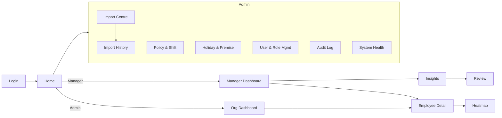

# Dashboard Specification

| | |
|---|---|
| **Version** | 1.0.0 |
| **Last updated** | 2026-08-02 |
| **Status** | Draft for Phase 3 (from approved Phase 1 requirements) |
| **Related** | [PRD](01_PRODUCT_REQUIREMENTS.md) · [Permissions](04_PERMISSION_MATRIX.md) · [UX Decisions](07_UX_DECISIONS.md) · [Attendance Rules](03_ATTENDANCE_RULES.md) |

> **Purpose.** Document every screen: purpose, widgets, user actions, validation, empty/loading states and permissions. Screen behaviour derives from approved PRD requirements; visual design is finalised in Phase 3.

---

## Table of Contents

1. [Navigation](#1-navigation)
2. [Screen: Google Login](#2-screen-google-login)
3. [Screen: Access Denied / Request](#3-screen-access-denied--request)
4. [Screen: Manager Dashboard](#4-screen-manager-dashboard)
5. [Screen: Organisation (Admin) Dashboard](#5-screen-organisation-admin-dashboard)
6. [Screen: Employee Detail](#6-screen-employee-detail)
7. [Screen: Attendance Heatmap](#7-screen-attendance-heatmap)
8. [Screen: Insight Lists](#8-screen-insight-lists)
9. [Screen: Review Workflow](#9-screen-review-workflow)
10. [Screen: Import Centre](#10-screen-import-centre)
11. [Screen: Import History & Detail](#11-screen-import-history--detail)
12. [Screen: Policy & Shift Settings](#12-screen-policy--shift-settings)
13. [Screen: Holiday & Premise Settings](#13-screen-holiday--premise-settings)
14. [Screen: User & Role Management](#14-screen-user--role-management)
15. [Screen: Audit Log](#15-screen-audit-log)
16. [Screen: System Health & Data Coverage](#16-screen-system-health--data-coverage)
17. [Cross-cutting: Cards, Filters, Charts, KPIs, Drill-downs](#17-cross-cutting-elements)

---

## 1. Navigation

Navigation items are **filtered by role** per the [Dashboard Visibility Matrix](04_PERMISSION_MATRIX.md#7-dashboard-visibility-matrix).

## 2. Screen: Google Login

| Aspect | Detail |
|---|---|
| **Purpose** | Authenticate via Google Workspace (edvoy.com) |
| **Widgets** | Sign-in-with-Google button; product name; support link |
| **User actions** | Click sign in |
| **Validation** | Domain allow-list; email ↔ active employee |
| **Empty state** | n/a |
| **Loading state** | Spinner during OAuth round-trip |
| **Permissions** | Public |

## 3. Screen: Access Denied / Request

| Aspect | Detail |
|---|---|
| **Purpose** | Explain no access and offer a request route |
| **Widgets** | Message; "Request access" button; status of any prior request |
| **User actions** | Submit access request |
| **Validation** | One open request per user |
| **Empty state** | No prior request |
| **Loading state** | Submitting request |
| **Permissions** | Authenticated but unauthorised |

## 4. Screen: Manager Dashboard

| Aspect | Detail |
|---|---|
| **Purpose** | A manager's month-to-date view of their team |
| **Widgets** | Summary cards; four insight lists; charts; data-coverage warnings; filter bar |
| **User actions** | Change filters; open a card/insight; go to employee detail |
| **Validation** | Filter values scoped to hierarchy; suppress frequency where denominator too small |
| **Empty state** | "No team data for this period" + coverage guidance |
| **Loading state** | Skeleton cards & list rows |
| **Permissions** | Reporting Manager (own line); Admin/Read-Only (all) |

**Summary cards:** total active employees, employees with attendance data, attendance coverage %, average effective hours, on-time %, frequently late, frequently below hours, confirmed unexplained absences, potential absence cases, frequent remote clock-ins, missing-punch cases, employees needing review. Each card shows current value, previous-period comparison, trend, definition tooltip, click-through.

## 5. Screen: Organisation (Admin) Dashboard

| Aspect | Detail |
|---|---|
| **Purpose** | Organisation-wide oversight |
| **Widgets** | Same card/insight/chart set, unrestricted scope; department/location comparisons |
| **User actions** | Filter across whole org; drill into any employee |
| **Validation** | None on scope (full access); coverage warnings apply |
| **Empty state** | "No data imported yet" → link to Import Centre |
| **Loading state** | Skeleton |
| **Permissions** | Administrator (edit context), Read-Only (view) |

## 6. Screen: Employee Detail

| Aspect | Detail |
|---|---|
| **Purpose** | Full, explainable attendance profile for one employee |
| **Widgets** | Employee info; manager; dept/sub-dept; location; shift & policy; period summary; attendance calendar; daily table; late/effective-hours/remote trends; absence & missing-punch history; policy exceptions; import source per record; manager notes; review history |
| **Daily table columns** | Date, Day, Scheduled status, Attendance status, Shift, In time, In premise, Out time, Out premise, Effective hours, Required hours, Late minutes, Hours deficit, Exception, Source import |
| **User actions** | Change period; open a day's evidence; add note; set review status |
| **Validation** | Access limited to hierarchy; every figure traceable to source import |
| **Empty state** | "No attendance records for this period (no data ≠ absent)" |
| **Loading state** | Skeleton table & charts |
| **Permissions** | Manager (own line), Admin, Read-Only; HR Operator only if granted |

## 7. Screen: Attendance Heatmap

| Aspect | Detail |
|---|---|
| **Purpose** | Team calendar/matrix of attendance-day status |
| **Widgets** | Employee rows × date columns; status colour + icon/label; tooltip (in/out, effective hours, premise, exception) |
| **User actions** | Hover for detail; click a cell → day evidence; filter |
| **Validation** | Scoped to hierarchy |
| **Empty state** | "No data for this period" |
| **Loading state** | Grey matrix skeleton |
| **Accessibility** | Never colour-only — status also shown by icon/label (see [UX](07_UX_DECISIONS.md#accessibility)) |
| **Permissions** | Manager (own line), Admin, Read-Only |

## 8. Screen: Insight Lists

Four lists, each with evidence columns and a review-status column.

| List | Key columns |
|---|---|
| **Frequently Late** | Employee, number, job title, sub-dept, manager, shift, late days, eligible days, late %, avg late min, trend, review status |
| **Frequently Below Required Hours** | Employee, sub-dept, required hours, avg effective hours, short-hour days, attended days, short-hours %, total deficit, trend, review status |
| **Frequent / Extended Absence** | Employee, confirmed absence days, potential absence days, approved leave days, longest consecutive, last attendance date, trend, review status |
| **High Remote Attendance** | Employee, remote days, office days, mixed days, remote %, approved arrangement, policy status, trend |

| Aspect | Detail |
|---|---|
| **Purpose** | Surface patterns worth a conversation |
| **User actions** | Sort/filter; open employee; set review status |
| **Validation** | Frequency suppressed on small denominators |
| **Empty state** | "No employees currently meet this threshold" |
| **Loading state** | Row skeletons |
| **Permissions** | Manager (own line), Admin, Read-Only (view) |

## 9. Screen: Review Workflow

| Aspect | Detail |
|---|---|
| **Purpose** | Record constructive follow-up |
| **Widgets** | Status selector; note fields (private / HR-visible); review & follow-up dates; agreed action; resolution reason; coaching-guidance panel |
| **Statuses** | New, Reviewed, Employee clarification requested, Support required, Action agreed, Monitoring, Resolved, No action required, Data correction required |
| **User actions** | Set status; add notes; set dates |
| **Validation** | Notes stored separately from raw data; access scoped |
| **Empty state** | "No review items" |
| **Loading state** | Form skeleton |
| **Permissions** | Manager (own line), Admin |

## 10. Screen: Import Centre

| Aspect | Detail |
|---|---|
| **Purpose** | Guided, safe import of each file type |
| **Steps** | 1 Select type → 2 Upload → 3 Preview & map → 4 Validate → 5 Summary → 6 Process → 7 Result |
| **Widgets** | Type cards (expected columns, last successful import, template, guidance); dropzone; header-mapping grid; validation summary; progress states |
| **User actions** | Select type; upload; map columns; import valid / reject / cancel; download rejects |
| **Validation** | Reject/Warn/Quarantine per [Data Spec §10](02_DATA_SPECIFICATION.md#10-data-validation-rules); fingerprint + logical key idempotency |
| **Processing states** | Queued, Validating, Importing, Calculating metrics, Completed, Completed with warnings, Failed, Cancelled |
| **Empty state** | "No imports yet" |
| **Loading state** | Progress bar with named stage |
| **Permissions** | Super Admin, Admin, HR Operator |

## 11. Screen: Import History & Detail

| Aspect | Detail |
|---|---|
| **Purpose** | Traceability of every import |
| **History columns** | Import ID, filename, type, uploaded by, timestamp, date range, rows, inserted, updated, rejected, warnings, status |
| **Detail widgets** | All history fields + processing times, failure reason, file hash, mapping version, duration; links: view records, download error report, download validation report, reprocess, roll back (permission), compare with previous |
| **User actions** | Open detail; download reports; reprocess; roll back |
| **Validation** | Roll back gated by permission |
| **Empty state** | "No imports yet" |
| **Loading state** | Row skeletons |
| **Permissions** | Super Admin, Admin, HR Operator (no roll back) |

## 12. Screen: Policy & Shift Settings

| Aspect | Detail |
|---|---|
| **Purpose** | Configure attendance policies and shifts |
| **Widgets** | Policy list (scoped + effective-dated); editors for grace, late threshold, frequency %, required hours, short-hours measure, remote threshold, min-records; shift definitions |
| **User actions** | Create/edit policy; set effective date; save |
| **Validation** | Numeric ranges; effective-date ordering; changes trigger recalculation + audit of old/new |
| **Empty state** | "No custom policies — org defaults apply" |
| **Loading state** | Form skeleton |
| **Permissions** | Super Admin, Admin |

## 13. Screen: Holiday & Premise Settings

| Aspect | Detail |
|---|---|
| **Purpose** | Manage holiday calendars (by location) and premise mappings |
| **Widgets** | Holiday calendar per location; premise-mapping table (Office/Remote/Adjustment/unclassified) |
| **User actions** | Add/edit holidays; classify premises |
| **Validation** | Holiday dates resolve to real dates; unresolved quarantined; unmapped premises flagged |
| **Empty state** | "No holidays loaded for this location" |
| **Loading state** | Table skeleton |
| **Permissions** | Super Admin, Admin |

## 14. Screen: User & Role Management

| Aspect | Detail |
|---|---|
| **Purpose** | Manage users, roles and admins |
| **Widgets** | User list; role assignment; admin management; pending access requests |
| **User actions** | Grant/revoke roles; add/remove admins; action requests |
| **Validation** | **Cannot remove final super-admin**; changes audited |
| **Empty state** | "No pending requests" |
| **Loading state** | Row skeletons |
| **Permissions** | Super Admin, Admin |

## 15. Screen: Audit Log

| Aspect | Detail |
|---|---|
| **Purpose** | Review sensitive actions |
| **Widgets** | Filterable log (actor, action, entity, timestamp); export |
| **User actions** | Filter; export |
| **Validation** | Read-only; no tokens/file contents present |
| **Empty state** | "No matching audit events" |
| **Loading state** | Row skeletons |
| **Permissions** | Super Admin, Admin |

## 16. Screen: System Health & Data Coverage

| Aspect | Detail |
|---|---|
| **Purpose** | Operational visibility & freshness |
| **Widgets** | Latest employee-master date; latest attendance date; days not yet imported; coverage by employee & date; failed-job indicators; unmapped-employee count |
| **User actions** | Drill into gaps; go to Import Centre |
| **Validation** | Warnings when data missing/stale or denominator too small |
| **Empty state** | "All data current" |
| **Loading state** | Card skeletons |
| **Permissions** | Super Admin, Admin (coverage subset visible to Managers) |

## 17. Cross-cutting Elements

**Filters:** date range, month, country, location, department, sub-department, cost centre, reporting manager, employee, job title, shift type, employment type, attendance status, work premise, alert type — **scoped to the user's access**.

**Cards / KPIs:** always current value + previous-period comparison + trend + definition tooltip + click-through.

**Charts (simple, honest, no misleading axes):** attendance trend by week; average effective hours by sub-department; on-time % by sub-department; late-arrival trend; short-hours trend; office vs remote; absence trend; missing-punch trend; department comparison; location comparison; weekday pattern.

**Drill-downs:** every card, insight and chart opens the supporting days and punches (explainability, [PRD G5](01_PRODUCT_REQUIREMENTS.md#4-product-goals)).
