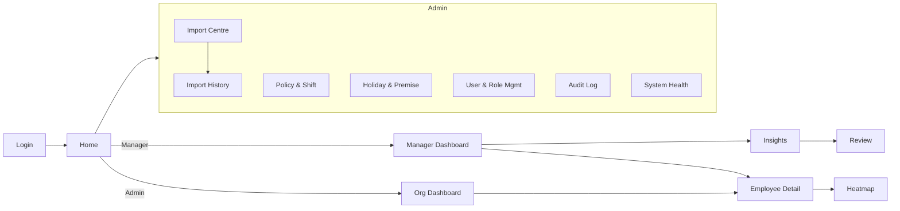

# Dashboard Specification

| | |
|---|---|
| **Version** | 1.4.0 |
| **Last updated** | 2026-08-06 |
| **Status** | Draft for Phase 3 (from approved Phase 1 requirements) |
| **Related** | [PRD](01_PRODUCT_REQUIREMENTS.md) · [Permissions](04_PERMISSION_MATRIX.md) · [UX Decisions](07_UX_DECISIONS.md) · [Attendance Rules](03_ATTENDANCE_RULES.md) · [Review Log Story](05a_USER_STORY_REVIEW_LOG.md) |

> **Purpose.** Document every screen: purpose, widgets, user actions, validation, empty/loading states and permissions. Screen behaviour derives from approved PRD requirements; visual design is finalised in Phase 3.

---

## Table of Contents

1. [Navigation](#1-navigation)
2. [Screen: Google Login](#2-screen-google-login)
3. [Screen: Access Denied / Request](#3-screen-access-denied--request)
4. [Screen: Manager Dashboard](#4-screen-manager-dashboard)
5. [Screen: Organisation (Admin) Dashboard](#5-screen-organisation-admin-dashboard)
6. [Screen: Employee Detail](#6-screen-employee-detail)
7. [Screen: Attendance Heatmap](#7-screen-attendance-heatmap)
8. [Screen: Insight Lists](#8-screen-insight-lists)
9. [Screen: Review Workflow](#9-screen-review-workflow)
9a. [Screen: Review Log](#9a-screen-review-log)
10. [Screen: Import Centre](#10-screen-import-centre)
11. [Screen: Import History & Detail](#11-screen-import-history--detail)
12. [Screen: Policy & Shift Settings](#12-screen-policy--shift-settings)
12a. [Action Flows: Import & Policy](#12a-action-flows-import--policy)
13. [Screen: Holiday & Premise Settings](#13-screen-holiday--premise-settings)
14. [Screen: User & Role Management](#14-screen-user--role-management)
15. [Screen: Audit Log](#15-screen-audit-log)
16. [Screen: System Health & Data Coverage](#16-screen-system-health--data-coverage)
17. [Cross-cutting: Cards, Filters, Charts, KPIs, Drill-downs](#17-cross-cutting-elements)
17a. [Date-Range Control](#17a-date-range-control)
17b. [Trend Bucketing by Range](#17b-trend-bucketing-by-range)

---

## 1. Navigation

Navigation items are **filtered by role** per the [Dashboard Visibility Matrix](04_PERMISSION_MATRIX.md#7-dashboard-visibility-matrix).

## 2. Screen: Google Login

| Aspect | Detail |
|---|---|
| **Purpose** | Authenticate via Google Workspace (edvoy.com) |
| **Widgets** | Sign-in-with-Google button; product name; support link |
| **User actions** | Click sign in |
| **Validation** | Domain allow-list; email ↔ active employee |
| **Empty state** | n/a |
| **Loading state** | Spinner during OAuth round-trip |
| **Permissions** | Public |

## 3. Screen: Access Denied / Request

| Aspect | Detail |
|---|---|
| **Purpose** | Explain no access and offer a request route |
| **Widgets** | Message; optional justification field; "Request access" button; status of any prior request. **No role selector** — the applicant never chooses a role |
| **User actions** | Submit access request (identity + optional justification only) |
| **Validation** | One open request per user |
| **Empty state** | No prior request |
| **Loading state** | Submitting request |
| **Permissions** | Authenticated but unauthorised |

## 4. Screen: Manager Dashboard

| Aspect | Detail |
|---|---|
| **Purpose** | A manager's month-to-date view of their team |
| **Widgets** | Summary cards; four insight lists; charts; data-coverage warnings; filter bar with the **date-range control** (§17a) |
| **User actions** | Change filters; open a card/insight; go to employee detail |
| **Validation** | Filter values scoped to hierarchy; suppress frequency where denominator too small |
| **Empty state** | "No team data for this period" + coverage guidance |
| **Loading state** | Skeleton cards & list rows |
| **Permissions** | Reporting Manager (own line); Admin/Read-Only (all) |

**Summary cards:** total active employees, employees with attendance data, attendance coverage %, average effective hours, on-time %, frequently late, frequently below hours, confirmed unexplained absences, potential absence cases, frequent remote clock-ins, missing-punch cases, employees needing review. Each card shows current value, previous-period comparison, trend, definition tooltip, click-through.

## 5. Screen: Organisation (Admin) Dashboard

| Aspect | Detail |
|---|---|
| **Purpose** | Organisation-wide oversight |
| **Widgets** | Same card/insight/chart set, unrestricted scope; department/location comparisons |
| **User actions** | Filter across whole org; drill into any employee |
| **Validation** | None on scope (full access); coverage warnings apply |
| **Empty state** | "No data imported yet" → link to Import Centre |
| **Loading state** | Skeleton |
| **Permissions** | Administrator (edit context), Read-Only (view) |

## 6. Screen: Employee Detail

| Aspect | Detail |
|---|---|
| **Purpose** | Full, explainable attendance profile for one employee |
| **Widgets** | Employee info; manager; dept/sub-dept; location; shift & policy; period summary; attendance calendar; daily table; late/effective-hours/remote trends; absence & missing-punch history; policy exceptions; import source per record; manager notes; review history |
| **Daily table columns** | Date, Day, Scheduled status, Attendance status, Shift, In time, In premise, Out time, Out premise, Effective hours, Required hours, Late minutes, Hours deficit, Exception, Source import |
| **User actions** | Change period; open a day's evidence; add note; set review status |
| **Validation** | Access limited to hierarchy; every figure traceable to source import |
| **Empty state** | "No attendance records for this period (no data ≠ absent)" |
| **Loading state** | Skeleton table & charts |
| **Permissions** | Manager (own line), Admin, Read-Only; HR Operator only if granted |

## 7. Screen: Attendance Heatmap

| Aspect | Detail |
|---|---|
| **Purpose** | Team calendar/matrix of attendance-day status |
| **Widgets** | Employee rows × date columns; status colour + icon/label; tooltip (in/out, effective hours, premise, exception) |
| **User actions** | Hover for detail; click a cell → day evidence; filter |
| **Validation** | Scoped to hierarchy |
| **Empty state** | "No data for this period" |
| **Loading state** | Grey matrix skeleton |
| **Accessibility** | Never colour-only — status also shown by icon/label (see [UX](07_UX_DECISIONS.md#accessibility)) |
| **Permissions** | Manager (own line), Admin, Read-Only |

## 8. Screen: Insight Lists

Four lists, each with evidence columns and a review-status column.

| List | Key columns |
|---|---|
| **Frequently Late** | Employee, number, job title, sub-dept, manager, shift, late days, eligible days, late %, avg late min, trend, review status |
| **Frequently Below Required Hours** | Employee, sub-dept, required hours, avg effective hours, short-hour days, attended days, short-hours %, total deficit, trend, review status |
| **Frequent / Extended Absence** | Employee, confirmed absence days, potential absence days, approved leave days, longest consecutive, last attendance date, trend, review status |
| **High Remote Attendance** | Employee, remote days, office days, mixed days, remote %, approved arrangement, policy status, trend |

| Aspect | Detail |
|---|---|
| **Purpose** | Surface patterns worth a conversation |
| **User actions** | Sort/filter; open employee; set review status |
| **Validation** | Frequency suppressed on small denominators |
| **Empty state** | "No employees currently meet this threshold" |
| **Loading state** | Row skeletons |
| **Permissions** | Manager (own line), Admin, Read-Only (view) |

## 9. Screen: Review Workflow

| Aspect | Detail |
|---|---|
| **Purpose** | Record constructive follow-up |
| **Widgets** | Status selector; note fields (private / HR-visible); review & follow-up dates; agreed action; resolution reason; coaching-guidance panel |
| **Statuses** | New, Reviewed, Employee clarification requested, Support required, Action agreed, Monitoring, Resolved, No action required, Data correction required |
| **User actions** | Set status; add notes; set dates; on save, go to the Review Log (“what’s next”) |
| **Validation** | Notes stored separately from raw data; access scoped |
| **Empty state** | "No review items" |
| **Loading state** | Form skeleton |
| **Permissions** | Manager (own line), Admin |

## 9a. Screen: Review Log

| Aspect | Detail |
|---|---|
| **Purpose** | A record of every attendance review, the action taken, and its follow-up — the defined “what’s next” after a review |
| **Widgets** | Outcome KPIs (Total, Open, Overdue follow-up, Closed — the last three filter on click); filter bar (search, status, action taken, state); log table (Review · Employee · Pattern · Status · Action taken · Opened · Follow-up); actions-taken breakdown chart; review-trail modal |
| **User actions** | Filter / search; open a record to see its full audit trail; continue a review; export the log |
| **Validation** | Hierarchy-scoped; private manager notes never listed, shown in the trail, or exported; export records who/when/filters/count |
| **Empty state** | “No reviews match these filters” |
| **Loading state** | Table skeleton |
| **Permissions** | Manager (own line), Admin, Read-Only (view) |

**Components introduced.** *Review-trail modal* — read-only history for one review (current status, action taken, opened, follow-up/overdue/closed, HR-visible note, and the chronological event list), with a “Continue review” action and a privacy note that private notes are never shown or exported. *Actions-taken chart* — a neutral bar chart of reviews by action taken; honest axis, no colour-as-verdict, never ranks people.

**Overdue.** An open review whose follow-up date has passed is labelled *Overdue* (label as well as any colour). Overdue is a prompt, not a judgement.

## 10. Screen: Import Centre

| Aspect | Detail |
|---|---|
| **Purpose** | Guided, safe import of each file type |
| **Steps** | 1 Select type → 2 Upload → 3 Preview & map → 4 Validate → 5 Summary → 6 Process → 7 Result |
| **Widgets** | Type cards (expected columns, last successful import, template, guidance); dropzone; header-mapping grid; validation summary; progress states |
| **User actions** | Select type; **download template (§12a.1)**; upload; map columns; import valid; **reject all & cancel (§12a.4)**; download rejects |
| **Validation** | Reject/Warn/Quarantine per [Data Spec §10](02_DATA_SPECIFICATION.md#10-data-validation-rules); fingerprint + logical key idempotency |
| **Processing states** | Queued, Validating, Importing, Calculating metrics, Completed, Completed with warnings, Failed, Cancelled |
| **Empty state** | "No imports yet" |
| **Loading state** | Progress bar with named stage |
| **Permissions** | Super Admin, Admin, HR Operator |

## 11. Screen: Import History & Detail

| Aspect | Detail |
|---|---|
| **Purpose** | Traceability of every import |
| **History columns** | Import ID, filename, type, uploaded by, timestamp, date range, rows, inserted, updated, rejected, warnings, status |
| **Detail widgets** | All history fields + processing times, failure reason, file hash, mapping version, duration; links: view records, download error report, download validation report, reprocess, roll back (permission), compare with previous |
| **User actions** | Open detail; **view imported records (§12a.2)**; **compare with previous (§12a.3)**; download reports; **reprocess (§12a.5)**; **roll back (§12a.6)** |
| **Validation** | Roll back gated by permission |
| **Empty state** | "No imports yet" |
| **Loading state** | Row skeletons |
| **Permissions** | Super Admin, Admin, HR Operator (no roll back) |

## 12. Screen: Policy & Shift Settings

| Aspect | Detail |
|---|---|
| **Purpose** | Configure attendance policies and shifts |
| **Widgets** | Policy list (scoped + effective-dated); editors for grace, late threshold, frequency %, required hours, short-hours measure, remote threshold, min-records; shift definitions |
| **User actions** | Create/edit policy; set effective date; **save & recalculate (§12a.7)** |
| **Validation** | Numeric ranges; effective-date ordering; changes trigger recalculation + audit of old/new |
| **Empty state** | "No custom policies — org defaults apply" |
| **Loading state** | Form skeleton |
| **Permissions** | Super Admin, Admin |

## 12a. Action Flows: Import & Policy

Earlier versions named these controls on the Import and Policy screens (§10, §11, §12) but did not define what each does when activated. This section specifies the flow behind every such control so none is a dead end. Each flow states its trigger, result, states, permissions and audit.

### 12a.1 Download template (Import Centre, §10)

| | |
|---|---|
| **Trigger** | "Download template" on a selected import type |
| **Result** | Downloads a blank CSV for that type, with the exact expected header row and one example data row; filename `<type>_template.csv`. No employee data. |
| **States** | Ready; (on generation) a brief "Preparing template…"; Completed (browser download). |
| **Errors** | If the type has no defined schema, the control is disabled with a tooltip. |
| **Permissions** | Any role that can reach Import Centre (Super Admin, Admin, HR Operator). |
| **Audit** | Not audited (no data leaves; template only). |

### 12a.2 View imported records (Import Detail, §11)

| | |
|---|---|
| **Trigger** | "View imported records" on an import-detail view |
| **Result** | Opens the set of rows this import inserted or updated, scoped to the viewer's access, as a filterable table (employee, date, status, insert/update flag). Read-only. |
| **States** | Loading (row skeletons); Loaded; Empty ("This import changed no rows"). |
| **Drill-down** | A row opens the employee/day evidence, consistent with the explainability rule (§17b, [PRD G5](01_PRODUCT_REQUIREMENTS.md#4-product-goals)). |
| **Permissions** | Super Admin, Admin, HR Operator — row-level access applied. |
| **Audit** | Viewing is not audited; any export from this view follows the export rules ([Permissions §9](04_PERMISSION_MATRIX.md#9-export-permissions)). |

### 12a.3 Compare with previous (Import Detail, §11)

| | |
|---|---|
| **Trigger** | "Compare with previous" on an import-detail view |
| **Result** | Shows a difference summary between this import and the **previous successful import of the same type**: counts of rows added, updated, unchanged and removed/absent, plus notable field-level changes (e.g. clock times, status). Presented as a read-only comparison, not an editable merge. |
| **No previous import** | The control is disabled with "No earlier import of this type to compare." |
| **States** | Loading; Loaded (diff summary); Empty ("No differences — identical to the previous import"). |
| **Idempotency link** | Uses the same fingerprint + logical-key identity as import idempotency ([Data Spec §10](02_DATA_SPECIFICATION.md#10-data-validation-rules)) so a re-upload of the same file reports "no differences" rather than fabricated churn. |
| **Permissions** | Super Admin, Admin, HR Operator. |
| **Audit** | Not audited (read-only comparison). |

### 12a.4 Reject all & cancel (Import Validate, §10)

| | |
|---|---|
| **Trigger** | "Reject all & cancel" during validation, before commit |
| **Result** | Abandons the import: the staged batch is discarded, **no rows are written**, and the wizard returns to the Import Centre. A confirmation step precedes the discard because it ends the import. |
| **States** | Confirm ("Discard this import? Nothing has been saved yet."); Cancelled (returns to Import Centre with a toast). |
| **Safety** | Because nothing was committed, this is a safe abort, distinct from **roll back** (§12a.6) which reverses a *committed* import. |
| **Permissions** | Super Admin, Admin, HR Operator. |
| **Audit** | Recorded as "Import cancelled at validation" with actor, type and timestamp. |

### 12a.5 Reprocess (Import Detail, §11)

| | |
|---|---|
| **Trigger** | "Reprocess" on a completed or failed import |
| **Result** | Re-runs validation and metric calculation for that import's source file **without a re-upload**, producing a new processing run linked to the same source. Idempotency prevents double-counting. |
| **States** | Queued → Validating → Importing → Calculating metrics → Completed / Completed with warnings / Failed (same state set as §10). |
| **Permissions** | Super Admin, Admin, HR Operator. |
| **Audit** | "Import reprocessed" with actor, import ID, timestamp and resulting status. |

### 12a.6 Roll back (Import Detail, §11 — permissioned)

| | |
|---|---|
| **Trigger** | "Roll back" on a committed import |
| **Result** | Reverses the effect of a committed import, restoring the prior state of the affected rows. Requires explicit confirmation naming the import and the number of rows affected. |
| **Gating** | Permission-gated: **HR Operator cannot roll back**; Super Admin and Admin can. May be feature-flagged to Phase 2 per the PRD; when disabled the control is hidden, not dead. |
| **States** | Confirm (impact named) → Rolling back → Completed / Failed. |
| **Permissions** | Super Admin, Admin only. |
| **Audit** | "Import rolled back" with actor, import ID, rows affected and timestamp. |

### 12a.7 Save & recalculate (Policy & Shift Settings, §12)

| | |
|---|---|
| **Trigger** | "Save & recalculate" after editing a policy or shift |
| **Result** | Persists the policy change with its **effective date**, then triggers recalculation of the metrics affected from that date forward. The change records **old → new** values. |
| **Validation** | Numeric ranges and effective-date ordering are checked before save; invalid input blocks the save with an inline message. No threshold's *meaning* changes — only its configured value, per [Attendance Rules §21](03_ATTENDANCE_RULES.md#21-configurable-thresholds). |
| **States** | Editing; (on save) Saving → Recalculating → Saved; Error (recalculation failed — the saved policy stands, a retry is offered). |
| **Permissions** | Super Admin, Admin. |
| **Audit** | "Policy changed" with actor, policy, old → new value, effective date and timestamp. |

> **Principle.** Every named control on these screens resolves to one of: a real result, a confirmation-then-result, a disabled state with a reason, or a hidden state when permission/'feature-flag forbids it. A control that is visible but inert is a defect.

## 13. Screen: Holiday & Premise Settings

| Aspect | Detail |
|---|---|
| **Purpose** | Manage holiday calendars (by location) and premise mappings |
| **Widgets** | Holiday calendar per location; premise-mapping table (Office/Remote/Adjustment/unclassified) |
| **User actions** | Add/edit holidays; classify premises |
| **Validation** | Holiday dates resolve to real dates; unresolved quarantined; unmapped premises flagged |
| **Empty state** | "No holidays loaded for this location" |
| **Loading state** | Table skeleton |
| **Permissions** | Super Admin, Admin |

## 14. Screen: User & Role Management

| Aspect | Detail |
|---|---|
| **Purpose** | Manage users, roles and admins |
| **Widgets** | User list; **Add user** (opens a dialog: identity + admin-selected role); per-user **Edit** (change role); admin management; pending access requests queue showing identity + justification (no applicant-supplied role) |
| **User actions** | Add user with a chosen role; change a user's role; add/remove admins; **approve a request by selecting the role to grant (default Read-Only)** or decline it |
| **Validation** | **Cannot remove final super-admin**; approval requires an explicit role choice; every add/role-change/approve/decline is audited (old → new where applicable). See [Permissions §3a](04_PERMISSION_MATRIX.md#3a-access-request--role-assignment-governance) |
| **Empty state** | "No pending requests" |
| **Loading state** | Row skeletons |
| **Permissions** | Super Admin, Admin |

## 15. Screen: Audit Log

| Aspect | Detail |
|---|---|
| **Purpose** | Review sensitive actions |
| **Widgets** | Filterable log (actor, action, entity, timestamp); export |
| **User actions** | Filter; export |
| **Validation** | Read-only; no tokens/file contents present |
| **Empty state** | "No matching audit events" |
| **Loading state** | Row skeletons |
| **Permissions** | Super Admin, Admin |

## 16. Screen: System Health & Data Coverage

| Aspect | Detail |
|---|---|
| **Purpose** | Operational visibility & freshness |
| **Widgets** | Latest employee-master date; latest attendance date; days not yet imported; coverage by employee & date; failed-job indicators; unmapped-employee count |
| **User actions** | Drill into gaps; go to Import Centre |
| **Validation** | Warnings when data missing/stale or denominator too small |
| **Empty state** | "All data current" |
| **Loading state** | Card skeletons |
| **Permissions** | Super Admin, Admin (coverage subset visible to Managers) |

## 17. Cross-cutting Elements

**Filters:** a **date-range control** (see §17a), plus country, location, department, sub-department, cost centre, reporting manager, employee, job title, shift type, employment type, attendance status, work premise, alert type — **scoped to the user's access**.

**Cards / KPIs:** always current value + previous-period comparison + trend + definition tooltip + click-through.

**Charts (simple, honest, no misleading axes):** attendance trend by week; average effective hours by sub-department; on-time % by sub-department; late-arrival trend; short-hours trend; office vs remote; absence trend; missing-punch trend; department comparison; location comparison; weekday pattern.

**Drill-downs:** every card, insight and chart opens the supporting days and punches (explainability, [PRD G5](01_PRODUCT_REQUIREMENTS.md#4-product-goals)).

---

## 17a. Date-Range Control

Every analytics screen (Manager Dashboard, Organisation Dashboard, Employee Detail, Heatmap, Insight Lists, Review Log) carries one shared date-range control. It sets the period all metrics, cards, insight lists and trends are computed over.

**Presets** (calendar-aligned by default):

| Preset | Window | Notes |
|---|---|---|
| Today | The current calendar day | Operational check; trends switch to intra-day or summary (see §17b) |
| Yesterday | The previous calendar day | Same intra-day/summary treatment as Today |
| This week | Monday 00:00 → now, current ISO week | Short-horizon check-in |
| **This month** *(default)* | 1st of the month → now (month-to-date) | Unchanged default; preserves prior behaviour |
| Last 3 months | Start of the month two months ago → now | Pattern horizon; aligns with frequency thresholds |
| Custom range | Any start–end the user picks | Bounded by available data; end defaults to today |

- **Default remains This month** (month-to-date) — no change to the landing behaviour agreed in [UX §7](07_UX_DECISIONS.md#7-dashboard-philosophy).
- **Calendar-aligned** windows are the default (a month means the 1st onward, a week means Monday onward), matching the existing "current calendar month" language. A policy option may switch an organisation to **rolling** windows (Last 7 / 30 / 90 days) where that suits reporting; the two must never be silently mixed, and the active mode is shown in the control's label.
- The chosen range is **reflected in the previous-period comparison**: "vs last month" becomes "vs previous period" of equal length (previous day, week, 3 months, or the equivalent custom span). Comparisons are only shown when a comparable prior period has data; otherwise the card shows the value without a delta and a short "no comparison period" note — never a fabricated trend.
- **Frequency metrics** (late %, short-hours %, absence, remote) still use **eligible days within the selected range** as the denominator, and the existing small-denominator suppression ([Attendance Rules §8](03_ATTENDANCE_RULES.md#8-attendance-percentage-rules)) applies: very short ranges (e.g. Today) will frequently suppress frequency flags and show a coverage note instead of an unreliable percentage. This is intended — a single day is not a pattern.
- **Coverage honesty:** when the selected range extends beyond the imported data, the screen shows the data it has and a coverage note ("showing available data for <range>"); it never pads missing days as zero or absent.
- Business rules, thresholds and classifications are **unchanged** — only the window they are computed over changes.

## 17b. Trend Bucketing by Range

Trend charts (weekly attendance, late-arrival, short-hours, absence, missing-punch, effective-hours) **must re-bucket to match the selected range** so the x-axis stays honest. A fixed four-week axis under a variable range would misrepresent the data and is not allowed.

| Selected range | Trend bucket | Approx. points |
|---|---|---|
| Today | Hourly, or a single-value summary card if punches are too few | ≤ 24 |
| Yesterday | Hourly, or summary | ≤ 24 |
| This week | Daily | 5–7 |
| This month | Weekly *(current behaviour)* | 4–5 |
| Last 3 months | Weekly (or monthly for very dense orgs) | ~12–13 |
| Custom range | Bucket chosen from the span: ≤ 2 days → hourly; ≤ 6 weeks → daily/weekly; longer → weekly/monthly | target 5–15 |

- **Honest axis, honest buckets.** The bucket unit is labelled on the axis (hours / days / weeks / months). Baselines still start at 0; no truncated axes.
- **Too few points → no fake line.** When a range yields fewer than two buckets (e.g. Today), the trend is shown as a **single summary value with its definition**, not a one-point "line" implying a trend.
- **Partial buckets** at the range edges are drawn but labelled partial (e.g. a part-week at the start of a 3-month view), so a short bar isn't misread as a decline.
- Bucketing changes only **presentation of the same underlying day-level data**; it introduces no new metric and changes no threshold.

