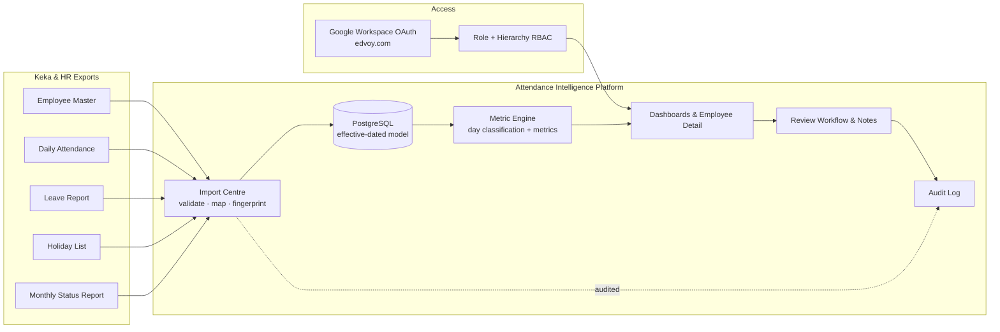
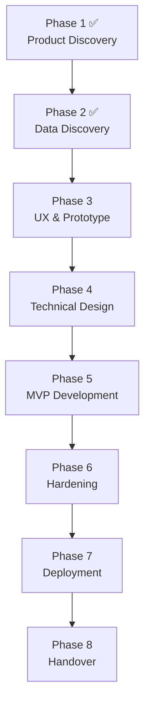

# Edvoy Workforce Attendance Intelligence Platform — Master Specification

| | |
|---|---|
| **Version** | 1.2.0 |
| **Last updated** | 2026-08-04 |
| **Status** | Phases 1–2 complete; Phase 3 (UX) next |
| **Owner** | Edvoy People & Engineering |

> **Purpose.** This is the homepage and single source of truth for the project. It is deliberately concise: it orients a new reader, summarises what is agreed, and links out to the detailed documents. It does **not** duplicate their content.

---

## Table of Contents

1. [Project Overview](#1-project-overview)
2. [Business Goals](#2-business-goals)
3. [Architecture Overview](#3-architecture-overview)
4. [Repository Structure](#4-repository-structure)
5. [Document Index](#5-document-index)
6. [Current Version](#6-current-version)
7. [Implementation Roadmap](#7-implementation-roadmap)
8. [Milestones](#8-milestones)
9. [Known Risks](#9-known-risks)
10. [Pending Decisions](#10-pending-decisions)
11. [References](#11-references)

---

## 1. Project Overview

Edvoy records attendance in **Keka** (clock-in/out, general and flexible shifts, remote and office punches, effective hours, department, location, reporting manager). Keka does not provide a management view that turns raw punches into patterns a reporting manager can act on.

This platform imports Keka's existing exports plus the employee payroll master, leave report and holiday list, validates and stores them with full history, calculates policy-aware attendance metrics, and gives managers and administrators an explainable, privacy-respecting view of attendance patterns.

**Guiding principle:** attendance data describes punches and calendars, not people. The platform helps a manager notice a pattern and start a supportive conversation. It is **not** a surveillance tool, a productivity score, or a disciplinary system. See [`01_PRODUCT_REQUIREMENTS.md`](01_PRODUCT_REQUIREMENTS.md).

---

## 2. Business Goals

| # | Goal | Detail |
|---|---|---|
| G1 | Make attendance legible to non-technical managers | Understand a team in minutes, not by decoding a spreadsheet |
| G2 | Show patterns and trends, not isolated incidents | A single late day is noise; a rising share is a signal |
| G3 | Respect each employee's actual shift | Lateness/short-hours judged against that person's shift and required hours |
| G4 | Distinguish the reason behind a missing day | Office, remote, leave, holiday, weekly off, missing punch, absence — told apart, not inferred from silence |
| G5 | Keep every number explainable | Every metric drills through to the days and punches behind it |
| G6 | Support constructive action | Managers record context, notes and follow-up |
| G7 | Reliable import & audit backbone | Validated, de-duplicated, versioned, auditable imports |
| G8 | Privacy by default | A manager sees only their hierarchy; sensitive actions logged |

---

## 3. Architecture Overview

Recommended stack (see [`08_TECHNICAL_CONSTRAINTS.md`](08_TECHNICAL_CONSTRAINTS.md)): Next.js + TypeScript + React + Tailwind (front end), modular monolith on Next.js route handlers or NestJS (back end), PostgreSQL + Prisma, Auth.js Google OAuth, S3 storage, BullMQ + Redis jobs, AWS ECS Fargate / RDS / S3 / Secrets Manager / CloudWatch / SES, Terraform or CDK.

---

## 4. Repository Structure

See the full tree in [Repository Tree](#4-repository-structure) at the end of this document set. Documentation lives under `docs/`. Application code, tests and infrastructure are added from Phase 5 onward.

---

## 5. Document Index

| File | Purpose |
|---|---|
| [`01_PRODUCT_REQUIREMENTS.md`](01_PRODUCT_REQUIREMENTS.md) | What the product must do, for whom, and why; MVP vs later scope |
| [`02_DATA_SPECIFICATION.md`](02_DATA_SPECIFICATION.md) | Source files, data dictionary, mappings, validation, import rules |
| [`03_ATTENDANCE_RULES.md`](03_ATTENDANCE_RULES.md) | Every calculation rule, formula, threshold and edge case |
| [`04_PERMISSION_MATRIX.md`](04_PERMISSION_MATRIX.md) | Roles, hierarchy, and matrices for data/API/dashboard/import/export |
| [`05_USER_STORIES.md`](05_USER_STORIES.md) | Epics and stories with acceptance criteria and priority |
| [`05a_USER_STORY_REVIEW_LOG.md`](05a_USER_STORY_REVIEW_LOG.md) | User story US-R1 — Review Log: follow-up tracking, outcome analytics, export |
| [`06_DASHBOARD_SPECIFICATION.md`](06_DASHBOARD_SPECIFICATION.md) | Every screen: widgets, actions, states, permissions |
| [`07_UX_DECISIONS.md`](07_UX_DECISIONS.md) | Navigation, layout, accessibility, terminology, design principles |
| [`08_TECHNICAL_CONSTRAINTS.md`](08_TECHNICAL_CONSTRAINTS.md) | Stack, hosting, security, privacy, performance targets |
| [`09_CHANGELOG.md`](09_CHANGELOG.md) | Version history, decision log, rejected ideas |
| `10_MASTER_SPECIFICATION.md` | This document — project homepage |

---

## 6. Current Version

**v1.2.0** — Tightens **access-request governance** (from the round-3 UX audit): the applicant submits identity and an optional justification only — never a role — and an administrator assigns the role on approval, defaulting to least-privilege Read-Only. Adds Permission Matrix §3a, User Story G5, and Dashboard Spec updates for Add/Edit-user role management. Additive; no attendance-rule changes.

**v1.1.0** — Adds the **Review Log** feature (US-R1 / FR20): a filterable, exportable record of every review with its status, action taken, follow-up date and a full per-review audit trail; surfaces overdue follow-ups and reports on outcomes, while private manager notes stay private. It is the defined “what’s next” after a manager reviews an employee. Additive only — no business rule, metric, or threshold changes. Reuses PD9 for retention; introduces no new pending decisions.

**v1.0.0** — Consolidation of Phase 1 (Product Discovery) and Phase 2 (Data Discovery). No application code exists yet. All figures are grounded in the July 2026 sample exports.

---

## 7. Implementation Roadmap

| Phase | Status | Output |
|---|---|---|
| 1 Product Discovery | ✅ Complete | PRD |
| 2 Data Discovery | ✅ Complete | Data spec, mappings, quality findings |
| 3 UX & Prototype | ⏭ Next | Sitemap, journeys, wireframes, prototype |
| 4 Technical Design | Planned | ADR, schema, ER diagram, API spec, threat model |
| 5 MVP Development | Planned | Auth, imports, dashboard, metrics, audit |
| 6 Hardening | Planned | Tests, security, performance, monitoring |
| 7 Deployment | Planned | Dev/staging/prod, IaC, CI/CD |
| 8 Handover | Planned | Docs, runbook, guides |

---

## 8. Milestones

| Milestone | Definition of done |
|---|---|
| M1 Discovery signed off | Phases 1–2 reviewed by HR, management, engineering |
| M2 Prototype approved | Clickable high-fidelity prototype validated against PRD |
| M3 Schema frozen | Data model + ER diagram + API spec agreed |
| M4 MVP demo | All 25 MVP acceptance criteria met on staging |
| M5 Production launch | Hardened, deployed, documented, handed over |

---

## 9. Known Risks

| ID | Risk | Impact | Mitigation |
|---|---|---|---|
| R1 | External manager IDs (1, 172, 177, 193, 200, 2070, BD005) not in master | Reports unreachable through normal hierarchy | External-manager stubs + resolution UI |
| R2 | Partial coverage — 82/161 master employees have no attendance rows | Absence mis-inferred if unhandled | "No data" ≠ "absent"; coverage checks |
| R3 | Unmapped attended employee (ED577) | Metrics attach to nobody | Quarantine unmapped in Import Centre |
| R4 | Holiday file inconsistent (6 formats across 6 sheets) | Wrong non-working days | Per-sheet tolerant parser; quarantine unresolved |
| R5 | Daily vs monthly source disagreement | Same day classified two ways | Daily is authoritative in MVP; reconcile later |
| R6 | Manager stored as name (daily) vs ID (master) | Broken hierarchy joins | Resolve hierarchy from master IDs only |

---

## 10. Pending Decisions

> These are **unresolved** and must not be assumed. Duplicated in [`01_PRODUCT_REQUIREMENTS.md`](01_PRODUCT_REQUIREMENTS.md#open-questions) and [`09_CHANGELOG.md`](09_CHANGELOG.md#decision-log).

| ID | Question | Blocks |
|---|---|---|
| PD1 | Identity of external managers 1, 172, 177, 193, 200, 2070, BD005 | Complete hierarchy |
| PD2 | Exact 5.5-day Saturday working pattern (which Saturdays) | Eligible-day denominator |
| PD3 | Do required hours include or exclude breaks? Effective vs total hours? | Short-hours precision |
| PD4 | Should flexible-shift staff have any core-hours start, or stay fully lateness-exempt? | Whether much of workforce is measured for lateness |
| PD5 | Are indirect reports visible to managers by default, or admin-enabled only? | Default privacy posture |
| PD6 | Is leave data always complete/timely, or assume gaps (lean on "potential absence")? | Absence conservatism |
| PD7 | Which premises are approved remote locations per employee/arrangement? | Remote-share vs arrangement |
| PD8 | Daily and monthly both imported — which is authoritative on conflict? | Reconciliation |
| PD9 | Data-retention periods (files, records, notes, audit, exports) | Governance controls |
| PD10 | Domain allow-list beyond edvoy.com; admin list beyond syed@edvoy.com | Sign-in & admin |

**Resolved decisions** (for contrast): required daily hours default = **8.30 hours (8h30m = 510 min)**, configurable per policy like the 20% threshold, with 9h as an admin override. See [`09_CHANGELOG.md`](09_CHANGELOG.md#decision-log).

---

## 11. References

- [`01_PRODUCT_REQUIREMENTS.md`](01_PRODUCT_REQUIREMENTS.md) · [`02_DATA_SPECIFICATION.md`](02_DATA_SPECIFICATION.md) · [`03_ATTENDANCE_RULES.md`](03_ATTENDANCE_RULES.md) · [`04_PERMISSION_MATRIX.md`](04_PERMISSION_MATRIX.md) · [`05_USER_STORIES.md`](05_USER_STORIES.md)
- [`06_DASHBOARD_SPECIFICATION.md`](06_DASHBOARD_SPECIFICATION.md) · [`07_UX_DECISIONS.md`](07_UX_DECISIONS.md) · [`08_TECHNICAL_CONSTRAINTS.md`](08_TECHNICAL_CONSTRAINTS.md) · [`09_CHANGELOG.md`](09_CHANGELOG.md)
